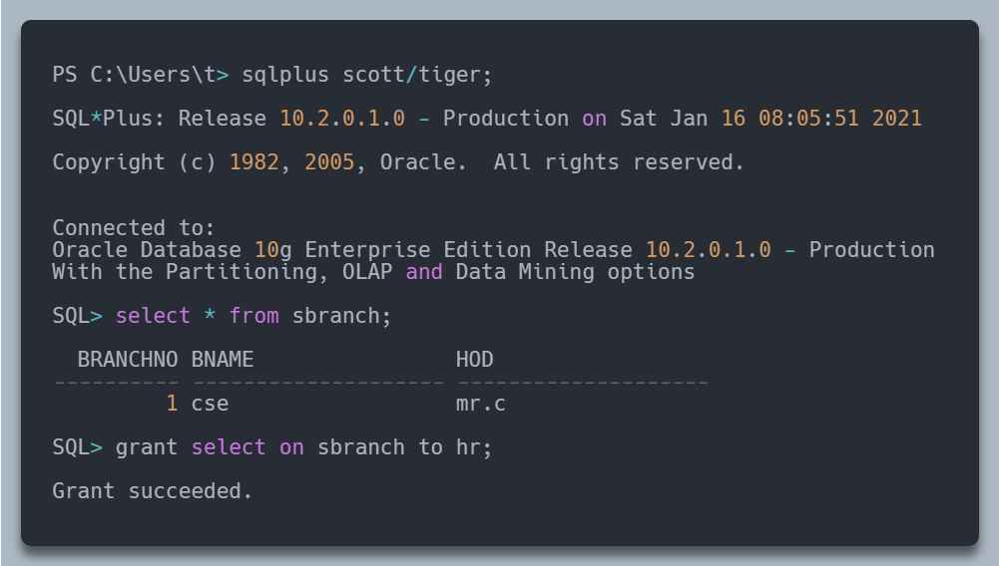
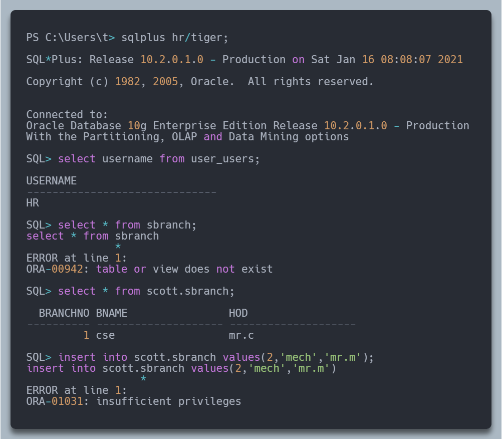
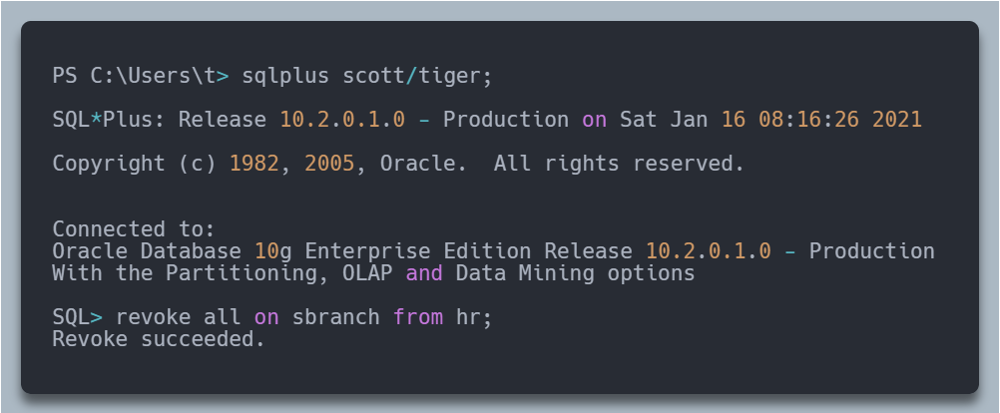
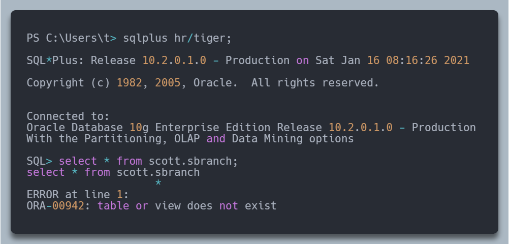
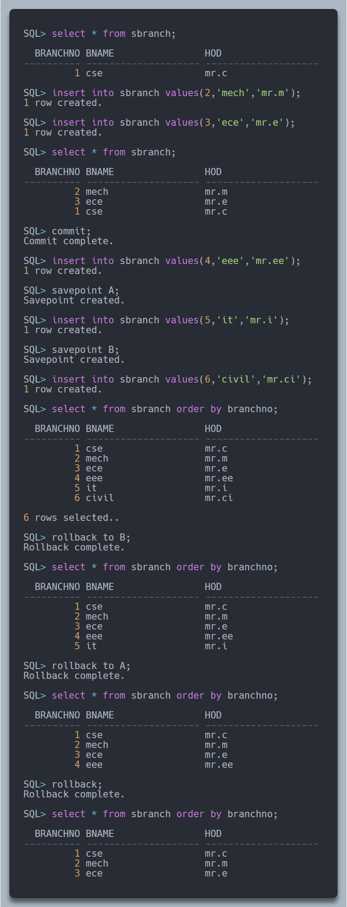

**Standard Queries**

> Note: All these commands are being run on oracle 10g sqlplus version

1.  <details>
    <summary>
        Display all the data in the employee table?
    </summary>

    ```sql
    SQL> select *
      2 from emp;
        EMPNO ENAME      JOB              MGR HIREDATE         SAL       COMM     DEPTNO
    ---------- ---------- --------- ---------- --------- ---------- ---------- ----------
        7369 SMITH      CLERK           7902 17-DEC-80        800                    20
        7499 ALLEN      SALESMAN        7698 20-FEB-81       1600        300         30
        7521 WARD       SALESMAN        7698 22-FEB-81       1250        500         30
        7566 JONES      MANAGER         7839 02-APR-81       2975                    20
        7654 MARTIN     SALESMAN        7698 28-SEP-81       1250       1400         30
        7698 BLAKE      MANAGER         7839 01-MAY-81       2850                    30
        7782 CLARK      MANAGER         7839 09-JUN-81       2450                    10
        7788 SCOTT      ANALYST         7566 19-APR-87       3000                    20
        7839 KING       PRESIDENT            17-NOV-81       5000                    10
        7844 TURNER     SALESMAN        7698 08-SEP-81       1500          0         30
        7876 ADAMS      CLERK           7788 23-MAY-87       1100                    20
        7900 JAMES      CLERK           7698 03-DEC-81        950                    30
        7902 FORD       ANALYST         7566 03-DEC-81       3000                    20
        7934 MILLER     CLERK           7782 23-JAN-82       1300                    10
    14 rows selected.
    ```

    </details>

1.  <details>
    <summary>
        Display any one column from the emp table?
    </summary>

    ```sql
    SQL> select ename
      2 from emp;

    ENAME
    ----------
    SMITH
    ALLEN
    WARD
    JONES
    MARTIN
    BLAKE
    CLARK
    SCOTT
    KING
    TURNER
    ADAMS
    JAMES
    FORD
    MILLER

    14 rows selected.
    ```

    </details>

1.  <details>
    <summary>
        Display any two columns from the emp table?
    </summary>

    ```sql
    SQL> select ename,job
      2 from emp;

    ENAME      JOB
    ---------- ---------
    SMITH      CLERK
    ALLEN      SALESMAN
    WARD       SALESMAN
    JONES      MANAGER
    MARTIN     SALESMAN
    BLAKE      MANAGER
    CLARK      MANAGER
    SCOTT      ANALYST
    KING       PRESIDENT
    TURNER     SALESMAN
    ADAMS      CLERK
    JAMES      CLERK
    FORD       ANALYST
    MILLER     CLERK

    14 rows selected.
    ```

    </details>

1.  <details>
    <summary>
        Display all data from department table?
    </summary>

    ```sql
    SQL> select *
      2 from emp;

        DEPTNO DNAME          LOC
    ---------- -------------- -------------
            10 ACCOUNTING     NEW YORK
            20 RESEARCH       DALLAS
            30 SALES          CHICAGO
            40 OPERATIONS     BOSTON
    ```

    </details>

1.  <details>
    <summary>
        Display any one column from the dept table?
    </summary>

    ```sql
    SQL> select dname
      2 from emp;

    DNAME
    --------------
    ACCOUNTING
    RESEARCH
    SALES
    OPERATIONS
    ```

    </details>

1.  <details>
    <summary>
        Display any two columns from the dept table?
    </summary>

    ```sql
    SQL> select dname,loc
      2 from emp;

    DNAME          LOC
    -------------- -------------
    ACCOUNTING     NEW YORK
    RESEARCH       DALLAS
    SALES          CHICAGO
    OPERATIONS     BOSTON
    ```

    </details>

1.  <details>
    <summary>
        Display all Employee names?
    </summary>

    ```sql
    SQL> select ename
      2 from emp;

    ENAME
    ----------
    SMITH
    ALLEN
    WARD
    JONES
    MARTIN
    BLAKE
    CLARK
    SCOTT
    KING
    TURNER
    ADAMS
    JAMES
    FORD
    MILLER

    14 rows selected.
    ```

    </details>

1.  <details>
    <summary>
        Display Employee names and their salaries?
    </summary>

    ```sql
    SQL> select ename,sal
      2 from emp;

    ENAME             SAL
    ---------- ----------
    SMITH             800
    ALLEN            1600
    WARD             1250
    JONES            2975
    MARTIN           1250
    BLAKE            2850
    CLARK            2450
    SCOTT            3000
    KING             5000
    TURNER           1500
    ADAMS            1100
    JAMES             950
    FORD             3000
    MILLER           1300

    14 rows selected.
    ```

    </details>

1.  <details>
    <summary>
        Display all department's names?
    </summary>

    ```sql
    SQL> select dname
      2 from emp;

    DNAME
    --------------
    ACCOUNTING
    RESEARCH
    SALES
    OPERATIONS
    ```

    </details>

1.  <details>
    <summary>
        Display Location of all departments?
    </summary>

    ```sql
    SQL> select dname,loc
      2 from emp;

    DNAME          LOC
    -------------- -------------
    ACCOUNTING     NEW YORK
    RESEARCH       DALLAS
    SALES          CHICAGO
    OPERATIONS     BOSTON
    ```

    </details>

1.  <details>
    <summary>
        Display Employee numbers and employee names?
    </summary>

    ```sql
    SQL> select empno,ename
      2 from emp;

        EMPNO ENAME
    ---------- ----------
        7369 SMITH
        7499 ALLEN
        7521 WARD
        7566 JONES
        7654 MARTIN
        7698 BLAKE
        7782 CLARK
        7788 SCOTT
        7839 KING
        7844 TURNER
        7876 ADAMS
        7900 JAMES
        7902 FORD
        7934 MILLER

    14 rows selected.
    ```

    </details>

1.  <details>
    <summary>
        Display Employee names as "Name"?
    </summary>

    ```sql
    SQL> select ename "Name"
      2 from emp;

    Name
    ----------
    SMITH
    ALLEN
    WARD
    JONES
    MARTIN
    BLAKE
    CLARK
    SCOTT
    KING
    TURNER
    ADAMS
    JAMES
    FORD
    MILLER

    14 rows selected.
    ```

    </details>

1.  <details>
    <summary>
        Display sal as salary, hire date as joining date for all employees?
    </summary>

    ```sql
    SQL> select ename Name, sal as "Salary",hiredate "Joined On"
      2 from emp;

    NAME           Salary Joined On
    ---------- ---------- ---------
    SMITH             800 17-DEC-80
    ALLEN            1600 20-FEB-81
    WARD             1250 22-FEB-81
    JONES            2975 02-APR-81
    MARTIN           1250 28-SEP-81
    BLAKE            2850 01-MAY-81
    CLARK            2450 09-JUN-81
    SCOTT            3000 19-APR-87
    KING             5000 17-NOV-81
    TURNER           1500 08-SEP-81
    ADAMS            1100 23-MAY-87
    JAMES             950 03-DEC-81
    FORD             3000 03-DEC-81
    MILLER           1300 23-JAN-82

    14 rows selected.
    ```

    </details>

1.  <details>
    <summary>
        Display employee name, employee number, sal as monthly salary, department number for all employees?
    </summary>

    ```sql
    SQL> select ename "Name",empno ID, sal "Monthly Salary", deptno
      2  from emp;

    Name               ID Monthly Salary     DEPTNO
    ---------- ---------- -------------- ----------
    SMITH            7369            800         20
    ALLEN            7499           1600         30
    WARD             7521           1250         30
    JONES            7566           2975         20
    MARTIN           7654           1250         30
    BLAKE            7698           2850         30
    CLARK            7782           2450         10
    SCOTT            7788           3000         20
    KING             7839           5000         10
    TURNER           7844           1500         30
    ADAMS            7876           1100         20
    JAMES            7900            950         30
    FORD             7902           3000         20
    MILLER           7934           1300         10

    14 rows selected.
    ```

    </details>

1.  <details>
    <summary>
        Display all employee details in the format "xxx(name) is xxx(job)"?
    </summary>

    ```sql
    SQL> select ename || ' is a ' || job
      2  from emp;

    ENAME||'ISA'||JOB
    -------------------------
    SMITH is a CLERK
    ALLEN is a SALESMAN
    WARD is a SALESMAN
    JONES is a MANAGER
    MARTIN is a SALESMAN
    BLAKE is a MANAGER
    CLARK is a MANAGER
    SCOTT is a ANALYST
    KING is a PRESIDENT
    TURNER is a SALESMAN
    ADAMS is a CLERK
    JAMES is a CLERK
    FORD is a ANALYST
    MILLER is a CLERK

    14 rows selected.
    ```

    </details>

1.  <details>
    <summary>
        Display employee name and salary of all employees?
    </summary>

    ```sql
    SQL> select ename "Name",sal "Salary"
      2  from emp;

    Name           Salary
    ---------- ----------
    SMITH             800
    ALLEN            1600
    WARD             1250
    JONES            2975
    MARTIN           1250
    BLAKE            2850
    CLARK            2450
    SCOTT            3000
    KING             5000
    TURNER           1500
    ADAMS            1100
    JAMES             950
    FORD             3000
    MILLER           1300

    14 rows selected.
    ```

    </details>

1.  <details>
    <summary>
        Display name, salary, commission, and date of joining of all employees?
    </summary>

    ```sql
    SQL> select ename "Name",sal "Salary",comm "Commission",hiredate "Joined On"
      2  from emp;

    Name           Salary Commission Joined On
    ---------- ---------- ---------- ---------
    SMITH             800            17-DEC-80
    ALLEN            1600        300 20-FEB-81
    WARD             1250        500 22-FEB-81
    JONES            2975            02-APR-81
    MARTIN           1250       1400 28-SEP-81
    BLAKE            2850            01-MAY-81
    CLARK            2450            09-JUN-81
    SCOTT            3000            19-APR-87
    KING             5000            17-NOV-81
    TURNER           1500          0 08-SEP-81
    ADAMS            1100            23-MAY-87
    JAMES             950            03-DEC-81
    FORD             3000            03-DEC-81
    MILLER           1300            23-JAN-82

    14 rows selected.
    ```

    </details>

1.  <details>
    <summary>
        Display employee name, designation, manager's employee number?
    </summary>

    ```sql
    SQL> select ename "Name",job,mgr "Manager ID"
      2  from emp;

    Name       JOB       Manager ID
    ---------- --------- ----------
    SMITH      CLERK           7902
    ALLEN      SALESMAN        7698
    WARD       SALESMAN        7698
    JONES      MANAGER         7839
    MARTIN     SALESMAN        7698
    BLAKE      MANAGER         7839
    CLARK      MANAGER         7839
    SCOTT      ANALYST         7566
    KING       PRESIDENT
    TURNER     SALESMAN        7698
    ADAMS      CLERK           7788
    JAMES      CLERK           7698
    FORD       ANALYST         7566
    MILLER     CLERK           7782

    14 rows selected.
    ```

    </details>

1.  <details>
    <summary>
        Display employee name and department number?
    </summary>

    ```sql
    SQL> select ename "Name",deptno
      2  from emp;

    Name           DEPTNO
    ---------- ----------
    SMITH              20
    ALLEN              30
    WARD               30
    JONES              20
    MARTIN             30
    BLAKE              30
    CLARK              10
    SCOTT              20
    KING               10
    TURNER             30
    ADAMS              20
    JAMES              30
    FORD               20
    MILLER             10

    14 rows selected.
    ```

    </details>

1.  <details>
    <summary>
        Display all details of each employee?
    </summary>

    ```sql
    SQL> select *
      2  from emp;

        EMPNO ENAME      JOB              MGR HIREDATE         SAL       COMM     DEPTNO
    ---------- ---------- --------- ---------- --------- ---------- ---------- ----------
        7369 SMITH      CLERK           7902 17-DEC-80        800   20
        7499 ALLEN      SALESMAN        7698 20-FEB-81       1600        300         30
        7521 WARD       SALESMAN        7698 22-FEB-81       1250        500         30
        7566 JONES      MANAGER         7839 02-APR-81       2975   20
        7654 MARTIN     SALESMAN        7698 28-SEP-81       1250       1400         30
        7698 BLAKE      MANAGER         7839 01-MAY-81       2850   30
        7782 CLARK      MANAGER         7839 09-JUN-81       2450   10
        7788 SCOTT      ANALYST         7566 19-APR-87       3000   20
        7839 KING       PRESIDENT            17-NOV-81       5000   10
        7844 TURNER     SALESMAN        7698 08-SEP-81       1500 0          30
        7876 ADAMS      CLERK           7788 23-MAY-87       1100   20
        7900 JAMES      CLERK           7698 03-DEC-81        950   30
        7902 FORD       ANALYST         7566 03-DEC-81       3000   20
        7934 MILLER     CLERK           7782 23-JAN-82       1300   10

    14 rows selected.
    ```

    </details>

1.  <details>
    <summary>
        Display all details of company departments?
    </summary>

    ```sql
    SQL> select *
      2  from dept;

        DEPTNO DNAME          LOC
    ---------- -------------- -------------
            10 ACCOUNTING     NEW YORK
            20 RESEARCH       DALLAS
            30 SALES          CHICAGO
            40 OPERATIONS     BOSTON
    ```

    </details>

1.  <details>
    <summary>
        Display employee name, employee number, salary, the annual salary of all employees?
    </summary>

    ```sql
    SQL> select ename "Name",empno "ID",sal "Salary",sal*12 "Annual Salary"
      2  from emp;

    Name               ID     Salary Annual Salary
    ---------- ---------- ---------- -------------
    SMITH            7369        800          9600
    ALLEN            7499       1600         19200
    WARD             7521       1250         15000
    JONES            7566       2975         35700
    MARTIN           7654       1250         15000
    BLAKE            7698       2850         34200
    CLARK            7782       2450         29400
    SCOTT            7788       3000         36000
    KING             7839       5000         60000
    TURNER           7844       1500         18000
    ADAMS            7876       1100         13200
    JAMES            7900        950         11400
    FORD             7902       3000         36000
    MILLER           7934       1300         15600

    14 rows selected.
    ```

    </details>

1.  <details>
    <summary>
        Display the employee name, employee number, salary, salary with a 30% hike for all employees?
    </summary>

    ```sql
    SQL> select ename "Name",empno "ID",sal "Salary",sal*1.30 "Hiked Salary"
      2  from emp;

    Name               ID     Salary Hiked Salary
    ---------- ---------- ---------- ------------
    SMITH            7369        800         1040
    ALLEN            7499       1600         2080
    WARD             7521       1250         1625
    JONES            7566       2975       3867.5
    MARTIN           7654       1250         1625
    BLAKE            7698       2850         3705
    CLARK            7782       2450         3185
    SCOTT            7788       3000         3900
    KING             7839       5000         6500
    TURNER           7844       1500         1950
    ADAMS            7876       1100         1430
    JAMES            7900        950         1235
    FORD             7902       3000         3900
    MILLER           7934       1300         1690

    14 rows selected.
    ```

    </details>

1.  Display the details of employees in the format

    1.  <details>
        <summary>
            "employee xxx earns a monthly salary of xxx rupees"
        </summary>

        ```sql
        SQL> select ename||' earns a monthly salary of '||sal||' rupees'
          2  from emp;

        ENAME||'EARNSAMONTHLYSALARYOF'||SAL||'RUPEES'
        -------------------------------------------------------------------------------------
        SMITH earns a monthly salary of 800 rupees
        ALLEN earns a monthly salary of 1600 rupees
        WARD earns a monthly salary of 1250 rupees
        JONES earns a monthly salary of 2975 rupees
        MARTIN earns a monthly salary of 1250 rupees
        BLAKE earns a monthly salary of 2850 rupees
        CLARK earns a monthly salary of 2450 rupees
        SCOTT earns a monthly salary of 3000 rupees
        KING earns a monthly salary of 5000 rupees
        TURNER earns a monthly salary of 1500 rupees
        ADAMS earns a monthly salary of 1100 rupees
        JAMES earns a monthly salary of 950 rupees
        FORD earns a monthly salary of 3000 rupees
        MILLER earns a monthly salary of 1300 rupees

        14 rows selected.
        ```

        </details>

    1.  <details>
        <summary>
            "employee xxx earns a monthly salary of xxx rupees and annual salary of xxx rupees"
        </summary>

        ```sql
        SQL> select ename||' earns a monthly salary of '||sal||' rupees and annual salary of '||sal*12||' rupees'
          2  from emp;

        ENAME||'EARNSAMONTHLYSALARYOF'||SAL||'RUPEESANDANNUALSALARYOF'||SAL*12||'RUPEES'
        ---------------------------------------------------------------------------------------------------------------------------------------------------------
        SMITH earns a monthly salary of 800 rupees and annual salary of 9600 rupees
        ALLEN earns a monthly salary of 1600 rupees and annual salary of 19200 rupees
        WARD earns a monthly salary of 1250 rupees and annual salary of 15000 rupees
        JONES earns a monthly salary of 2975 rupees and annual salary of 35700 rupees
        MARTIN earns a monthly salary of 1250 rupees and annual salary of 15000 rupees
        BLAKE earns a monthly salary of 2850 rupees and annual salary of 34200 rupees
        CLARK earns a monthly salary of 2450 rupees and annual salary of 29400 rupees
        SCOTT earns a monthly salary of 3000 rupees and annual salary of 36000 rupees
        KING earns a monthly salary of 5000 rupees and annual salary of 60000 rupees
        TURNER earns a monthly salary of 1500 rupees and annual salary of 18000 rupees
        ADAMS earns a monthly salary of 1100 rupees and annual salary of 13200 rupees
        JAMES earns a monthly salary of 950 rupees and annual salary of 11400 rupees
        FORD earns a monthly salary of 3000 rupees and annual salary of 36000 rupees
        MILLER earns a monthly salary of 1300 rupees and annual salary of 15600 rupees

        14 rows selected.
        ```

        </details>

    1.  <details>
        <summary>
            "the xxx department with department number xxx is located in xxx"
        </summary>

        ```sql
        SQL> select 'The '||dname||' department with department number '||deptno||' is located in '||loc
          2  from dept;

        'THE'||DNAME||'DEPARTMENTWITHDEPARTMENTNUMBER'||DEPTNO||'ISLOCATEDIN'||LOC
        -------------------------------------------------------------------------------------------------------------------------
        The ACCOUNTING department with department number 10 is located in NEW YORK
        The RESEARCH department with department number 20 is located in DALLAS
        The SALES department with department number 30 is located in CHICAGO
        The OPERATIONS department with department number 40 is located in BOSTON
        ```

        </details>

1.  <details>
    <summary>
        Display the name of the employee, monthly salary, a monthly bonus of 200, annual salary(bonus included) with suitable alias names?
    </summary>

    ```sql
        SQL> select ename "Name",sal "Monthly Salary",sal+200 "Monthly Salary(Bonus)",(sal+200)*12 "Annual Salary(Bonus)"
          2  from emp;

        Name       Monthly Salary Monthly Salary(Bonus) Annual Salary(Bonus)
        ---------- -------------- --------------------- ---------------------
        SMITH                 800                  1000                 12000
        ALLEN                1600                  1800                 21600
        WARD                 1250                  1450                 17400
        JONES                2975                  3175                 38100
        MARTIN               1250                  1450                 17400
        BLAKE                2850                  3050                 36600
        CLARK                2450                  2650                 31800
        SCOTT                3000                  3200                 38400
        KING                 5000                  5200                 62400
        TURNER               1500                  1700                 20400
        ADAMS                1100                  1300                 15600
        JAMES                 950                  1150                 13800
        FORD                 3000                  3200                 38400
        MILLER               1300                  1500                 18000

        14 rows selected.
    ```

    </details>

1.  <details>
    <summary>
        Display the name of the employee, salary, annual salary, annual salary with a yearly bonus of 100?
    </summary>

    ```sql
        SQL> select ename "Name",sal "Monthly Salary",sal*12 "Annual Salary",(sal*12)+100 "Annual Salary(Bonus)"
          2  from emp;

        Name       Monthly Salary Annual Salary Annual Salary(Bonus)
        ---------- -------------- ------------- --------------------
        SMITH                 800          9600                 9700
        ALLEN                1600         19200                19300
        WARD                 1250         15000                15100
        JONES                2975         35700                35800
        MARTIN               1250         15000                15100
        BLAKE                2850         34200                34300
        CLARK                2450         29400                29500
        SCOTT                3000         36000                36100
        KING                 5000         60000                60100
        TURNER               1500         18000                18100
        ADAMS                1100         13200                13300
        JAMES                 950         11400                11500
        FORD                 3000         36000                36100
        MILLER               1300         15600                15700

        14 rows selected.
    ```

    </details>

1.  <details>
    <summary>
        Display All Information of Scott?
    </summary>

    ```sql
    SQL> select *
      2  from emp
      3  where ename='SCOTT';

        EMPNO ENAME      JOB              MGR HIREDATE         SAL       COMM     DEPTNO
    ---------- ---------- --------- ---------- --------- ---------- ---------- ----------
        7788 SCOTT      ANALYST         7566 19-APR-87       3000                    20
    ```

    </details>

1.  <details>
    <summary>
        Display Adams Job?
    </summary>

    ```sql
    SQL> select ename "Name",job
      2  from emp
      3  where ename='ADAMS';

    Name      JOB
    ---------- ---------
    ADAMS      CLERK
    ```

    </details>

1.  <details>
    <summary>
        Display miller's salary and department?
    </summary>

    ```sql
    SQL> select ename "Name",sal "Monthly Salary",deptno
      2  from emp
      3  where ename='MILLER';

    Name       Monthly Salary     DEPTNO
    ---------- -------------- ----------
    MILLER               1300         10
    ```

    </details>

1.  <details>
    <summary>
        Display Names of all clerks?
    </summary>

    ```sql
    SQL> select ename "Name",job
      2  from emp
      3  where job='CLERK';

    Name       JOB
    ---------- ---------
    SMITH      CLERK
    ADAMS      CLERK
    JAMES      CLERK
    MILLER     CLERK
    ```

    </details>

1.  <details>
    <summary>
        Display all employee details working in department number 20?
    </summary>

    ```sql
    SQL> select *
      2  from emp
      3  where deptno=20;

        EMPNO ENAME      JOB              MGR HIREDATE         SAL       COMM     DEPTNO
    ---------- ---------- --------- ---------- --------- ---------- ---------- ----------
        7369 SMITH      CLERK           7902 17-DEC-80        800                    20
        7566 JONES      MANAGER         7839 02-APR-81       2975                    20
        7788 SCOTT      ANALYST         7566 19-APR-87       3000                    20
        7876 ADAMS      CLERK           7788 23-MAY-87       1100                    20
        7902 FORD       ANALYST         7566 03-DEC-81       3000                    20
    ```

    </details>

1.  <details>
    <summary>
        Display employee names whose salary is more than 1500?
    </summary>

    ```sql
    SQL> select ename "Name",sal
      2  from emp
      3  where sal>1500;

    Name              SAL
    ---------- ----------
    ALLEN            1600
    JONES            2975
    BLAKE            2850
    CLARK            2450
    SCOTT            3000
    KING             5000
    FORD             3000

    7 rows selected.
    ```

    </details>

1.  <details>
    <summary>
        Display employee name, job, the salary of an employee with employee id 7902?
    </summary>

    ```sql
    SQL> select empno,ename "Name",job,sal "Monthly Salary"
      2  from emp
      3  where empno=7902;

        EMPNO Name       JOB       Monthly Salary
    ---------- ---------- --------- --------------
        7902 FORD       ANALYST             3000
    ```

    </details>

1.  <details>
    <summary>
        Display all employee's information who joined on 30-dec-1981?
    </summary>

    ```sql
    SQL> select *
      2  from emp
      3  where hiredate='30-DEC-1981';

    no rows selected
    ```

    </details>

1.  <details>
    <summary>
        Display all details of analysts?
    </summary>

    ```sql
    SQL> select *
      2  from emp
      3  where job='ANALYST';

        EMPNO ENAME      JOB              MGR HIREDATE         SAL       COMM     DEPTNO
    ---------- ---------- --------- ---------- --------- ---------- ---------- ----------
        7788 SCOTT      ANALYST         7566 19-APR-87       3000                    20
        7902 FORD       ANALYST         7566 03-DEC-81       3000                    20
    ```

    </details>

1.  <details>
    <summary>
        Display all information of employees who work under a manager with employee id 7698?
    </summary>

    ```sql
    SQL> select *
      2  from emp
      3  where mgr=7698;

        EMPNO ENAME      JOB              MGR HIREDATE         SAL       COMM     DEPTNO
    ---------- ---------- --------- ---------- --------- ---------- ---------- ----------
        7499 ALLEN      SALESMAN        7698 20-FEB-81       1600        300         30
        7521 WARD       SALESMAN        7698 22-FEB-81       1250        500         30
        7654 MARTIN     SALESMAN        7698 28-SEP-81       1250       1400         30
        7844 TURNER     SALESMAN        7698 08-SEP-81       1500          0         30
        7900 JAMES      CLERK           7698 03-DEC-81        950                    30
    ```

    </details>

1.  <details>
    <summary>
        Display all Employee names whose salary is less than 1500?
    </summary>

    ```sql
    SQL> select ename "Name",sal
      2  from emp
      3  where sal<1500;

    Name              SAL
    ---------- ----------
    SMITH             800
    WARD             1250
    MARTIN           1250
    ADAMS            1100
    JAMES             950
    MILLER           1300

    6 rows selected.
    ```

    </details>

1.  <details>
    <summary>
        Display Employee name, hire date, salary, annual salary if his annual salary is more than 10,000?
    </summary>

    ```sql
    SQL> select ename "Name",hiredate "Joined On",sal "Monthly Salary",sal*12 "Annual Salary"
      2  from emp
      3  where sal*12 > 10000;

    Name       Joined On Monthly Salary Annual Salary
    ---------- --------- -------------- -------------
    ALLEN      20-FEB-81           1600         19200
    WARD       22-FEB-81           1250         15000
    JONES      02-APR-81           2975         35700
    MARTIN     28-SEP-81           1250         15000
    BLAKE      01-MAY-81           2850         34200
    CLARK      09-JUN-81           2450         29400
    SCOTT      19-APR-87           3000         36000
    KING       17-NOV-81           5000         60000
    TURNER     08-SEP-81           1500         18000
    ADAMS      23-MAY-87           1100         13200
    JAMES      03-DEC-81            950         11400
    FORD       03-DEC-81           3000         36000
    MILLER     23-JAN-82           1300         15600

    13 rows selected.
    ```

    </details>

1.  <details>
    <summary>
        Display all details of managers?
    </summary>

    ```sql
    SQL> select *
      2  from emp
      3  where job='MANAGER';

        EMPNO ENAME      JOB              MGR HIREDATE         SAL       COMM     DEPTNO
    ---------- ---------- --------- ---------- --------- ---------- ---------- ----------
        7566 JONES      MANAGER         7839 02-APR-81       2975                    20
        7698 BLAKE      MANAGER         7839 01-MAY-81       2850                    30
        7782 CLARK      MANAGER         7839 09-JUN-81       2450                    10
    ```

    </details>

1.  <details>
    <summary>
        Display details of all employees who are hired after 1995?
    </summary>

    ```sql
    SQL> select *
      2  from emp
      3  where hiredate > '31-DEC-1995';

    no rows selected
    ```

    </details>

1.  <details>
    <summary>
        Display employee's details whose comm is exactly 1400?
    </summary>

    ```sql
    SQL> select *
      2  from emp
      3  where comm=1400;

        EMPNO ENAME      JOB              MGR HIREDATE         SAL       COMM     DEPTNO
    ---------- ---------- --------- ---------- --------- ---------- ---------- ----------
        7654 MARTIN     SALESMAN        7698 28-SEP-81       1250       1400         30
    ```

    </details>

1.  <details>
    <summary>
        Display clerk details working in department 20?
    </summary>

    ```sql
    SQL> select *
      2  from emp
      3  where job='CLERK' and deptno=20;

        EMPNO ENAME      JOB              MGR HIREDATE         SAL       COMM     DEPTNO
    ---------- ---------- --------- ---------- --------- ---------- ---------- ----------
        7369 SMITH      CLERK           7902 17-DEC-80        800                    20
        7876 ADAMS      CLERK           7788 23-MAY-87       1100                    20
    ```

    </details>

1.  <details>
    <summary>
        Display employee details who work in department 20 and earn more than 1500?
    </summary>

    ```sql
    SQL> select *
      2  from emp
      3  where deptno=20 and sal>1500;

        EMPNO ENAME      JOB              MGR HIREDATE         SAL       COMM     DEPTNO
    ---------- ---------- --------- ---------- --------- ---------- ---------- ----------
        7566 JONES      MANAGER         7839 02-APR-81       2975                    20
        7788 SCOTT      ANALYST         7566 19-APR-87       3000                    20
        7902 FORD       ANALYST         7566 03-DEC-81       3000                    20
    ```

    </details>

1.  <details>
    <summary>
        Display employee names working in department 10,30? (without special operators)
    </summary>

    ```sql
    SQL> select ename "Name",deptno
      2  from emp
      3  where deptno=10 or deptno=30;

    Name           DEPTNO
    ---------- ----------
    ALLEN              30
    WARD               30
    MARTIN             30
    BLAKE              30
    CLARK              10
    KING               10
    TURNER             30
    JAMES              30
    MILLER             10

    9 rows selected.
    ```

    </details>

1.  <details>
    <summary>
        Display managers and analyst information? (without special operators)
    </summary>

    ```sql
    SQL> select *
      2  from emp
      3  where job='ANALYST' or job='MANAGER';

        EMPNO ENAME      JOB              MGR HIREDATE         SAL       COMM     DEPTNO
    ---------- ---------- --------- ---------- --------- ---------- ---------- ----------
        7566 JONES      MANAGER         7839 02-APR-81       2975                    20
        7698 BLAKE      MANAGER         7839 01-MAY-81       2850                    30
        7782 CLARK      MANAGER         7839 09-JUN-81       2450                    10
        7788 SCOTT      ANALYST         7566 19-APR-87       3000                    20
        7902 FORD       ANALYST         7566 03-DEC-81       3000                    20
    ```

    </details>

1.  <details>
    <summary>
        Display employee details who earn between 1000 and 2000(Inclusive)? (without special operators)
    </summary>

    ```sql
    SQL> select *
      2  from emp
      3  where sal>=1000 and sal<=2000;

        EMPNO ENAME      JOB              MGR HIREDATE         SAL       COMM     DEPTNO
    ---------- ---------- --------- ---------- --------- ---------- ---------- ----------
        7499 ALLEN      SALESMAN        7698 20-FEB-81       1600        300         30
        7521 WARD       SALESMAN        7698 22-FEB-81       1250        500         30
        7654 MARTIN     SALESMAN        7698 28-SEP-81       1250       1400         30
        7844 TURNER     SALESMAN        7698 08-SEP-81       1500          0         30
        7876 ADAMS      CLERK           7788 23-MAY-87       1100                    20
        7934 MILLER     CLERK           7782 23-JAN-82       1300                    10

    6 rows selected.
    ```

    </details>

1.  <details>
    <summary>
        Display employee details who joined in the year 1981? (without special operators)
    </summary>

    ```sql
    SQL> select *
      2  from emp
      3  where hiredate>='01-JAN-1981' and hiredate<='31-DEC-1981';

        EMPNO ENAME      JOB              MGR HIREDATE         SAL       COMM     DEPTNO
    ---------- ---------- --------- ---------- --------- ---------- ---------- ----------
        7499 ALLEN      SALESMAN        7698 20-FEB-81       1600        300         30
        7521 WARD       SALESMAN        7698 22-FEB-81       1250        500         30
        7566 JONES      MANAGER         7839 02-APR-81       2975                    20
        7654 MARTIN     SALESMAN        7698 28-SEP-81       1250       1400         30
        7698 BLAKE      MANAGER         7839 01-MAY-81       2850                    30
        7782 CLARK      MANAGER         7839 09-JUN-81       2450                    10
        7839 KING       PRESIDENT            17-NOV-81       5000                    10
        7844 TURNER     SALESMAN        7698 08-SEP-81       1500          0         30
        7900 JAMES      CLERK           7698 03-DEC-81        950                    30
        7902 FORD       ANALYST         7566 03-DEC-81       3000                    20

    10 rows selected.
    ```

    </details>

1.  <details>
    <summary>
        Display employee names working in department 10,30?
    </summary>

    ```sql
    SQL> select *
      2  from emp
      3  where deptno in (10,30);

        EMPNO ENAME      JOB              MGR HIREDATE         SAL       COMM     DEPTNO
    ---------- ---------- --------- ---------- --------- ---------- ---------- ----------
        7499 ALLEN      SALESMAN        7698 20-FEB-81       1600        300         30
        7521 WARD       SALESMAN        7698 22-FEB-81       1250        500         30
        7654 MARTIN     SALESMAN        7698 28-SEP-81       1250       1400         30
        7698 BLAKE      MANAGER         7839 01-MAY-81       2850                    30
        7782 CLARK      MANAGER         7839 09-JUN-81       2450                    10
        7839 KING       PRESIDENT            17-NOV-81       5000                    10
        7844 TURNER     SALESMAN        7698 08-SEP-81       1500          0         30
        7900 JAMES      CLERK           7698 03-DEC-81        950                    30
        7934 MILLER     CLERK           7782 23-JAN-82       1300                    10

    9 rows selected.
    ```

    </details>

1.  <details>
    <summary>
        Display managers and analyst information?
    </summary>

    ```sql
    SQL> select *
      2  from emp
      3  where job in ('ANALYST','MANAGER');

        EMPNO ENAME      JOB              MGR HIREDATE         SAL       COMM     DEPTNO
    ---------- ---------- --------- ---------- --------- ---------- ---------- ----------
        7566 JONES      MANAGER         7839 02-APR-81       2975                    20
        7698 BLAKE      MANAGER         7839 01-MAY-81       2850                    30
        7782 CLARK      MANAGER         7839 09-JUN-81       2450                    10
        7788 SCOTT      ANALYST         7566 19-APR-87       3000                    20
        7902 FORD       ANALYST         7566 03-DEC-81       3000                    20
    ```

    </details>

1.  <details>
    <summary>
        Display employee details who earn between 1000 and 2000(Inclusive)?
    </summary>

    ```sql
    SQL> select *
      2  from emp
      3  where sal between 1000 and 2000;

        EMPNO ENAME      JOB              MGR HIREDATE         SAL       COMM     DEPTNO
    ---------- ---------- --------- ---------- --------- ---------- ---------- ----------
        7499 ALLEN      SALESMAN        7698 20-FEB-81       1600        300         30
        7521 WARD       SALESMAN        7698 22-FEB-81       1250        500         30
        7654 MARTIN     SALESMAN        7698 28-SEP-81       1250       1400         30
        7844 TURNER     SALESMAN        7698 08-SEP-81       1500          0         30
        7876 ADAMS      CLERK           7788 23-MAY-87       1100                    20
        7934 MILLER     CLERK           7782 23-JAN-82       1300                    10

    6 rows selected.
    ```

    </details>

1.  <details>
    <summary>
        Display employee details who joined in the year 1981?
    </summary>

    ```sql
    SQL> select *
      2  from emp
      3  where hiredate like '%81%';

        EMPNO ENAME      JOB              MGR HIREDATE         SAL       COMM     DEPTNO
    ---------- ---------- --------- ---------- --------- ---------- ---------- ----------
        7499 ALLEN      SALESMAN        7698 20-FEB-81       1600        300         30
        7521 WARD       SALESMAN        7698 22-FEB-81       1250        500         30
        7566 JONES      MANAGER         7839 02-APR-81       2975                    20
        7654 MARTIN     SALESMAN        7698 28-SEP-81       1250       1400         30
        7698 BLAKE      MANAGER         7839 01-MAY-81       2850                    30
        7782 CLARK      MANAGER         7839 09-JUN-81       2450                    10
        7839 KING       PRESIDENT            17-NOV-81       5000                    10
        7844 TURNER     SALESMAN        7698 08-SEP-81       1500          0         30
        7900 JAMES      CLERK           7698 03-DEC-81        950                    30
        7902 FORD       ANALYST         7566 03-DEC-81       3000                    20

    10 rows selected.
    ```

    </details>

1.  <details>
    <summary>
        Display employee name, salary, annual salary, annual salary with 25% hike for clerks, and joining date is 16 June 1982?
    </summary>

    ```sql
    SQL> select ename "Name",sal "Salary",sal*12 "Annual Salary",(sal*12)*1.25 "Annual Salary(Hiked)"
      2  from emp
      3  where job='CLERK' and hiredate='16-JUN-1982';

    no rows selected
    ```

    </details>

1.  <details>
    <summary>
        Display employee details if the annual salary is greater than 15,000 and commission is greater than his salary?
    </summary>

    ```sql
    SQL> select *
      2  from emp
      3  where sal*12>15000 and comm>sal;

    no rows selected
    ```

    </details>

1.  <details>
    <summary>
        Display all details for department number 100 or department name is research?
    </summary>

    ```sql
    SQL> select *
      2  from dept
      3  where deptno=100 or dname='RESEARCH';

        DEPTNO DNAME          LOC
    ---------- -------------- -------------
            20 RESEARCH       DALLAS
    ```

    </details>

1.  <details>
    <summary>
        Display employee name, employee number, hire date, salary, salary with 20% pay cut if his salary is greater than 2500 and works in department number 10.
    </summary>

    ```sql
    SQL> select ename "Name",empno "ID",hiredate "Joined On",sal "Salary",sal*0.80 "Deducted Salary"
      2  from emp
      3  where sal>2500 and deptno=10;

    Name               ID Joined On     Salary Deducted Salary
    ---------- ---------- --------- ---------- ---------------
    KING             7839 17-NOV-81       5000            4000
    ```

    </details>

1.  <details>
    <summary>
        Display details who work in either department 10 or 20 and earn more than 2,000?
    </summary>

    ```sql
    SQL> select *
      2  from emp
      3  where deptno in (10,20) and sal>2000;

        EMPNO ENAME      JOB              MGR HIREDATE         SAL       COMM     DEPTNO
    ---------- ---------- --------- ---------- --------- ---------- ---------- ----------
        7566 JONES      MANAGER         7839 02-APR-81       2975                    20
        7782 CLARK      MANAGER         7839 09-JUN-81       2450                    10
        7788 SCOTT      ANALYST         7566 19-APR-87       3000                    20
        7839 KING       PRESIDENT            17-NOV-81       5000                    10
        7902 FORD       ANALYST         7566 03-DEC-81       3000                    20
    ```

    </details>

1.  <details>
    <summary>
        Display all details of salesman and analysts?
    </summary>

    ```sql
    SQL> select *
      2  from emp
      3  where job in ('SALESMAN','ANALYST');

        EMPNO ENAME      JOB              MGR HIREDATE         SAL       COMM     DEPTNO
    ---------- ---------- --------- ---------- --------- ---------- ---------- ----------
        7499 ALLEN      SALESMAN        7698 20-FEB-81       1600        300         30
        7521 WARD       SALESMAN        7698 22-FEB-81       1250        500         30
        7654 MARTIN     SALESMAN        7698 28-SEP-81       1250       1400         30
        7788 SCOTT      ANALYST         7566 19-APR-87       3000                    20
        7844 TURNER     SALESMAN        7698 08-SEP-81       1500          0         30
        7902 FORD       ANALYST         7566 03-DEC-81       3000                    20

    6 rows selected.
    ```

    </details>

1.  <details>
    <summary>
        Display details of salesman and analyst if they are working in department number 10 or 20 and earn more than 2,000?
    </summary>

    ```sql
    SQL> select *
      2  from emp
      3  where job in ('SALESMAN','ANALYST') and deptno in (10,20) and sal>2000;

        EMPNO ENAME      JOB              MGR HIREDATE         SAL       COMM     DEPTNO
    ---------- ---------- --------- ---------- --------- ---------- ---------- ----------
        7788 SCOTT      ANALYST         7566 19-APR-87       3000                    20
        7902 FORD       ANALYST         7566 03-DEC-81       3000                    20
    ```

    </details>

1.  <details>
    <summary>
        Display details of salesman and clerk who earns more than 3,000 and doesn't earn exactly 2,500, having depart number 10,20,30?
    </summary>

    ```sql
    SQL> select *
      2  from emp
      3  where job in ('SALESMAN','CLERK') and sal>3000 and sal!=2500 and deptno in (10,20,30);

    no rows selected
    ```

    </details>

1.  <details>
    <summary>
        Display all clerks name, job, commission, department number, salary, salary with 35% cut and works in depart number 10 or 20 or 30, having hired after 1983 and commission is less than salary?
    </summary>

    ```sql
    SQL> select ename "Name",job,comm "Commission",deptno "Department Number",sal "Salary",sal*0.65 "Reduced Salary"
      2  from emp
      3  where deptno in (10,20,30) and hiredate>'31-DEC-1983' and comm<sal;

    no rows selected
    ```

    </details>

1.  <details>
    <summary>
        Display employee details who are working in department 10 or 20 or 30?
    </summary>

    ```sql
    SQL> select *
      2  from emp
      3  where deptno in (10,20,30);

        EMPNO ENAME      JOB              MGR HIREDATE         SAL       COMM     DEPTNO
    ---------- ---------- --------- ---------- --------- ---------- ---------- ----------
        7369 SMITH      CLERK           7902 17-DEC-80        800                    20
        7499 ALLEN      SALESMAN        7698 20-FEB-81       1600        300         30
        7521 WARD       SALESMAN        7698 22-FEB-81       1250        500         30
        7566 JONES      MANAGER         7839 02-APR-81       2975                    20
        7654 MARTIN     SALESMAN        7698 28-SEP-81       1250       1400         30
        7698 BLAKE      MANAGER         7839 01-MAY-81       2850                    30
        7782 CLARK      MANAGER         7839 09-JUN-81       2450                    10
        7788 SCOTT      ANALYST         7566 19-APR-87       3000                    20
        7839 KING       PRESIDENT            17-NOV-81       5000                    10
        7844 TURNER     SALESMAN        7698 08-SEP-81       1500          0         30
        7876 ADAMS      CLERK           7788 23-MAY-87       1100                    20
        7900 JAMES      CLERK           7698 03-DEC-81        950                    30
        7902 FORD       ANALYST         7566 03-DEC-81       3000                    20
        7934 MILLER     CLERK           7782 23-JAN-82       1300                    10

    14 rows selected.
    ```

    </details>

1.  <details>
    <summary>
        Display all employee details working in department 10 or 20 and has a commission between 1000 and 3000, were hired between 1980-1983?
    </summary>

    ```sql
    SQL> select *
      2  from emp
      3  where deptno in (10,20) and comm between 1000 and 3000 and hiredate between '01-JAN-1980' and '31-DEC-1983';

    no rows selected
    ```

    </details>

1.  <details>
    <summary>
        Display employee details who don't have a manager?
    </summary>

    ```sql
    SQL> select *
      2  from emp
      3  where mgr is null;

        EMPNO ENAME      JOB              MGR HIREDATE         SAL       COMM     DEPTNO
    ---------- ---------- --------- ---------- --------- ---------- ---------- ----------
        7839 KING       PRESIDENT            17-NOV-81       5000                    10
    ```

    </details>

1.  <details>
    <summary>
        Display employee details who don't take a commission?
    </summary>

    ```sql
    SQL> select *
      2  from emp
      3  where comm is null;

        EMPNO ENAME      JOB              MGR HIREDATE         SAL       COMM     DEPTNO
    ---------- ---------- --------- ---------- --------- ---------- ---------- ----------
        7369 SMITH      CLERK           7902 17-DEC-80        800                    20
        7566 JONES      MANAGER         7839 02-APR-81       2975                    20
        7698 BLAKE      MANAGER         7839 01-MAY-81       2850                    30
        7782 CLARK      MANAGER         7839 09-JUN-81       2450                    10
        7788 SCOTT      ANALYST         7566 19-APR-87       3000                    20
        7839 KING       PRESIDENT            17-NOV-81       5000                    10
        7876 ADAMS      CLERK           7788 23-MAY-87       1100                    20
        7900 JAMES      CLERK           7698 03-DEC-81        950                    30
        7902 FORD       ANALYST         7566 03-DEC-81       3000                    20
        7934 MILLER     CLERK           7782 23-JAN-82       1300                    10

    10 rows selected.
    ```

    </details>

1.  <details>
    <summary>
        Display employee details whose name starts with 'A'?
    </summary>

    ```sql
    SQL> select *
      2  from emp
      3  where ename like 'A%';

        EMPNO ENAME      JOB              MGR HIREDATE         SAL       COMM     DEPTNO
    ---------- ---------- --------- ---------- --------- ---------- ---------- ----------
        7499 ALLEN      SALESMAN        7698 20-FEB-81       1600        300         30
        7876 ADAMS      CLERK           7788 23-MAY-87       1100                    20
    ```

    </details>

1.  <details>
    <summary>
        Display employee details whose name starts and ends with 'A'?
    </summary>

    ```sql
    SQL> select *
      2  from emp
      3  where ename like 'A%A';

    no rows selected
    ```

    </details>

1.  <details>
    <summary>
        Display employee details who has at least two 'A's in their name?
    </summary>

    ```sql
    SQL> select *
      2  from emp
      3  where ename like '%A%A';

    no rows selected
    ```

    </details>

1.  <details>
    <summary>
        Display employee details whose name starts with 'M'?
    </summary>

    ```sql
    SQL> select *
      2  from emp
      3  where ename like 'M%';

        EMPNO ENAME      JOB              MGR HIREDATE         SAL       COMM     DEPTNO
    ---------- ---------- --------- ---------- --------- ---------- ---------- ----------
        7654 MARTIN     SALESMAN        7698 28-SEP-81       1250       1400         30
        7934 MILLER     CLERK           7782 23-JAN-82       1300                    10
    ```

    </details>

1.  <details>
    <summary>
        Display employee details whose name contains 'MAD'?
    </summary>

    ```sql
    SQL> select *
      2  from emp
      3  where ename like '%MAD%';

    no rows selected
    ```

    </details>

1.  <details>
    <summary>
        Display employee details whose name contains 'NA' at least once?
    </summary>

    ```sql
    SQL> select *
      2  from emp
      3  where ename like '%NA%';

    no rows selected
    ```

    </details>

1.  <details>
    <summary>
        Display employee details whose name has 'R' as the second last character?
    </summary>

    ```sql
    SQL> select *
      2  from emp
      3  where ename like '%R_';

        EMPNO ENAME      JOB              MGR HIREDATE         SAL       COMM     DEPTNO
    ---------- ---------- --------- ---------- --------- ---------- ---------- ----------
        7521 WARD       SALESMAN        7698 22-FEB-81       1250        500         30
        7782 CLARK      MANAGER         7839 09-JUN-81       2450                    10
        7902 FORD       ANALYST         7566 03-DEC-81       3000                    20
    ```

    </details>

1.  <details>
    <summary>
        Display employee details whose name starts with 'S'?
    </summary>

    ```sql
    SQL> select *
      2  from emp
      3  where ename like 'S%';

        EMPNO ENAME      JOB              MGR HIREDATE         SAL       COMM     DEPTNO
    ---------- ---------- --------- ---------- --------- ---------- ---------- ----------
        7369 SMITH      CLERK           7902 17-DEC-80        800                    20
        7788 SCOTT      ANALYST         7566 19-APR-87       3000                    20
    ```

    </details>

1.  <details>
    <summary>
        Display employee details whose name has 'L' as the second character?
    </summary>

    ```sql
    SQL> select *
      2  from emp
      3  where ename like '_L%';

        EMPNO ENAME      JOB              MGR HIREDATE         SAL       COMM     DEPTNO
    ---------- ---------- --------- ---------- --------- ---------- ---------- ----------
        7499 ALLEN      SALESMAN        7698 20-FEB-81       1600        300         30
        7698 BLAKE      MANAGER         7839 01-MAY-81       2850                    30
        7782 CLARK      MANAGER         7839 09-JUN-81       2450                    10
    ```

    </details>

1.  <details>
    <summary>
        Display employee details whose name has 'L' at least twice?
    </summary>

    ```sql
    SQL> select *
      2  from emp
      3  where ename like '%L%L%';

        EMPNO ENAME      JOB              MGR HIREDATE         SAL       COMM     DEPTNO
    ---------- ---------- --------- ---------- --------- ---------- ---------- ----------
        7499 ALLEN      SALESMAN        7698 20-FEB-81       1600        300         30
        7934 MILLER     CLERK           7782 23-JAN-82       1300                    10
    ```

    </details>

1.  <details>
    <summary>
       Display employee details whose name has 'E' as the last but one character?
    </summary>

    ```sql
    SQL> select *
      2  from emp
      3  where ename like '%E_';

        EMPNO ENAME      JOB              MGR HIREDATE         SAL       COMM     DEPTNO
    ---------- ---------- --------- ---------- --------- ---------- ---------- ----------
        7499 ALLEN      SALESMAN        7698 20-FEB-81       1600        300         30
        7566 JONES      MANAGER         7839 02-APR-81       2975                    20
        7844 TURNER     SALESMAN        7698 08-SEP-81       1500          0         30
        7900 JAMES      CLERK           7698 03-DEC-81        950                    30
        7934 MILLER     CLERK           7782 23-JAN-82       1300                    10
    ```

    </details>

1.  <details>
    <summary>
        Display employee details whose name has 'R' in the 3rd position?
    </summary>

    ```sql
    SQL> select *
      2  from emp
      3  where ename like '___R%';

        EMPNO ENAME      JOB              MGR HIREDATE         SAL       COMM     DEPTNO
    ---------- ---------- --------- ---------- --------- ---------- ---------- ----------
        7782 CLARK      MANAGER         7839 09-JUN-81       2450                    10
    ```

    </details>

1.  <details>
    <summary>
        Display the first letter of every employee's name?
    </summary>

    ```sql
    SQL> select ename "Name",substr(ename,1,1) "First Character"
      2  from emp;

    Name       F
    ---------- -
    SMITH      S
    ALLEN      A
    WARD       W
    JONES      J
    MARTIN     M
    BLAKE      B
    CLARK      C
    SCOTT      S
    KING       K
    TURNER     T
    ADAMS      A
    JAMES      J
    FORD       F
    MILLER     M

    14 rows selected.
    ```

    </details>

1.  <details>
    <summary>
        Display the Last letter of every employee's name?
    </summary>

    ```sql
    SQL> select ename "Name",substr(ename,-1,1) "Last Character"
      2  from emp;

    Name       L
    ---------- -
    SMITH      H
    ALLEN      N
    WARD       D
    JONES      S
    MARTIN     N
    BLAKE      E
    CLARK      K
    SCOTT      T
    KING       G
    TURNER     R
    ADAMS      S
    JAMES      S
    FORD       D
    MILLER     R

    14 rows selected.
    ```

    </details>

1.  <details>
    <summary>
        Display the Last letter of every employee's name without using -1 in the substring?
    </summary>

    ```sql
    SQL> select ename "Name",length(ename) "Length(Name)",substr(ename,length(ename)) "Last Char"
      2  from emp;

    Name       Length(Name) Last Char
    ---------- ------------ ----------
    SMITH                 5 H
    ALLEN                 5 N
    WARD                  4 D
    JONES                 5 S
    MARTIN                6 N
    BLAKE                 5 E
    CLARK                 5 K
    SCOTT                 5 T
    KING                  4 G
    TURNER                6 R
    ADAMS                 5 S
    JAMES                 5 S
    FORD                  4 D
    MILLER                6 R

    14 rows selected.
    ```

    </details>

1.  <details>
    <summary>
        Display the first three characters of every job?
    </summary>

    ```sql
    SQL> select job,substr(job,1,3)
      2  from emp;

    JOB       SUB
    --------- ---
    CLERK     CLE
    SALESMAN  SAL
    SALESMAN  SAL
    MANAGER   MAN
    SALESMAN  SAL
    MANAGER   MAN
    MANAGER   MAN
    ANALYST   ANA
    PRESIDENT PRE
    SALESMAN  SAL
    CLERK     CLE
    CLERK     CLE
    ANALYST   ANA
    CLERK     CLE

    14 rows selected.
    ```

    </details>

1.  <details>
    <summary>
        Display employee names after removing 'A' from it?
    </summary>

    ```sql
    SQL> select ename "Name",replace(ename,'A') "Removed A"
      2  from emp;

    Name       Removed A
    ---------- ----------
    SMITH      SMITH
    ALLEN      LLEN
    WARD       WRD
    JONES      JONES
    MARTIN     MRTIN
    BLAKE      BLKE
    CLARK      CLRK
    SCOTT      SCOTT
    KING       KING
    TURNER     TURNER
    ADAMS      DMS
    JAMES      JMES
    FORD       FORD
    MILLER     MILLER

    14 rows selected.
    ```

    </details>

1.  <details>
    <summary>
        Display the number of 'A' characters present in each employee name?
    </summary>

    ```sql
    SQL> select ename "Name",replace(ename,'A') "Removed A",length(replace(ename,'A')) "Length After"
      2  from emp;

    Name       Removed A  Length After
    ---------- ---------- ------------
    SMITH      SMITH                 5
    ALLEN      LLEN                  4
    WARD       WRD                   3
    JONES      JONES                 5
    MARTIN     MRTIN                 5
    BLAKE      BLKE                  4
    CLARK      CLRK                  4
    SCOTT      SCOTT                 5
    KING       KING                  4
    TURNER     TURNER                6
    ADAMS      DMS                   3
    JAMES      JMES                  4
    FORD       FORD                  4
    MILLER     MILLER                6

    14 rows selected.
    ```

    </details>

1.  <details>
    <summary>
        Display employee names having exactly 4 character length? (without using Like)
    </summary>

    ```sql
    SQL> select *
      2  from emp
      3  where length(ename)=4;

        EMPNO ENAME      JOB              MGR HIREDATE         SAL       COMM     DEPTNO
    ---------- ---------- --------- ---------- --------- ---------- ---------- ----------
        7521 WARD       SALESMAN        7698 22-FEB-81       1250        500         30
        7839 KING       PRESIDENT            17-NOV-81       5000                    10
        7902 FORD       ANALYST         7566 03-DEC-81       3000                    20
    ```

    </details>

1.  <details>
    <summary>
        Display employee names and jobs where the job starts with 'MAN'?(without using like)
    </summary>

    ```sql
    SQL> select *
      2  from emp
      3  where substr(job,1,3)='MAN';

        EMPNO ENAME      JOB              MGR HIREDATE         SAL       COMM     DEPTNO
    ---------- ---------- --------- ---------- --------- ---------- ---------- ----------
        7566 JONES      MANAGER         7839 02-APR-81       2975                    20
        7698 BLAKE      MANAGER         7839 01-MAY-81       2850                    30
        7782 CLARK      MANAGER         7839 09-JUN-81       2450                    10
    ```

    </details>

1.  <details>
    <summary>
        Display employee details who joined in February? (without using like)?
    </summary>

    ```sql
    SQL> select *
      2  from emp
      3  where substr(hiredate,4,3)='FEB';

        EMPNO ENAME      JOB              MGR HIREDATE         SAL       COMM     DEPTNO
    ---------- ---------- --------- ---------- --------- ---------- ---------- ----------
        7499 ALLEN      SALESMAN        7698 20-FEB-81       1600        300         30
        7521 WARD       SALESMAN        7698 22-FEB-81       1250        500         30
    ```

    </details>

1.  <details>
    <summary>
        Display employee details whose name has 'E' as last but one character? (without like)
    </summary>

    ```sql
    SQL> select *
      2  from emp
      3  where substr(ename,-2,1)='E';

        EMPNO ENAME      JOB              MGR HIREDATE         SAL       COMM     DEPTNO
    ---------- ---------- --------- ---------- --------- ---------- ---------- ----------
        7499 ALLEN      SALESMAN        7698 20-FEB-81       1600        300         30
        7566 JONES      MANAGER         7839 02-APR-81       2975                    20
        7844 TURNER     SALESMAN        7698 08-SEP-81       1500          0         30
        7900 JAMES      CLERK           7698 03-DEC-81        950                    30
        7934 MILLER     CLERK           7782 23-JAN-82       1300                    10
    ```

    </details>

1.  <details>
    <summary>
        Count number of A's in each employee name?
    </summary>

    ```sql
    SQL> select ename "Name",length(ename) "Length",replace(ename,'A') "Removed A",length(replace(ename,'A')) "Replaced Length"
      2  from emp;

    Name           Length Removed A  Replaced Length
    ---------- ---------- ---------- ---------------
    SMITH               5 SMITH                    5
    ALLEN               5 LLEN                     4
    WARD                4 WRD                      3
    JONES               5 JONES                    5
    MARTIN              6 MRTIN                    5
    BLAKE               5 BLKE                     4
    CLARK               5 CLRK                     4
    SCOTT               5 SCOTT                    5
    KING                4 KING                     4
    TURNER              6 TURNER                   6
    ADAMS               5 DMS                      3
    JAMES               5 JMES                     4
    FORD                4 FORD                     4
    MILLER              6 MILLER                   6

    14 rows selected.
    ```

    </details>

1.  <details>
    <summary>
        Display position of first M character in employee name?
    </summary>

    ```sql
    SQL> select ename "Name",instr(ename,'M',1,1) "M Index"
      2  from emp;

    Name          M Index
    ---------- ----------
    SMITH               2
    ALLEN               0
    WARD                0
    JONES               0
    MARTIN              1
    BLAKE               0
    CLARK               0
    SCOTT               0
    KING                0
    TURNER              0
    ADAMS               4
    JAMES               3
    FORD                0
    MILLER              1

    14 rows selected.
    ```

    </details>

1.  <details>
    <summary>
        Display all employee names starting with 'A' using instring function?
    </summary>

    ```sql
    SQL> select *
      2  from emp
      3  where instr(ename,'A')=1;

        EMPNO ENAME      JOB              MGR HIREDATE         SAL       COMM     DEPTNO
    ---------- ---------- --------- ---------- --------- ---------- ---------- ----------
        7499 ALLEN      SALESMAN        7698 20-FEB-81       1600        300         30
        7876 ADAMS      CLERK           7788 23-MAY-87       1100                    20
    ```

    </details>

1.  <details>
    <summary>
        Display employee whose job has MAN?(with out like)
    </summary>

    ```sql
    SQL> select *
      2  from emp
      3  where length(job)!=length(replace(job,'MAN'));

        EMPNO ENAME      JOB              MGR HIREDATE         SAL       COMM     DEPTNO
    ---------- ---------- --------- ---------- --------- ---------- ---------- ----------
        7499 ALLEN      SALESMAN        7698 20-FEB-81       1600        300         30
        7521 WARD       SALESMAN        7698 22-FEB-81       1250        500         30
        7566 JONES      MANAGER         7839 02-APR-81       2975                    20
        7654 MARTIN     SALESMAN        7698 28-SEP-81       1250       1400         30
        7698 BLAKE      MANAGER         7839 01-MAY-81       2850                    30
        7782 CLARK      MANAGER         7839 09-JUN-81       2450                    10
        7844 TURNER     SALESMAN        7698 08-SEP-81       1500          0         30

    7 rows selected.
    ```

    </details>

1.  <details>
    <summary>
        Display employee details whose name has 'L'?(With out like)
    </summary>

    ```sql
    SQL> select *
      2  from emp
      3  where length(ename)>length(replace(ename,'L'));

        EMPNO ENAME      JOB              MGR HIREDATE         SAL       COMM     DEPTNO
    ---------- ---------- --------- ---------- --------- ---------- ---------- ----------
        7499 ALLEN      SALESMAN        7698 20-FEB-81       1600        300         30
        7698 BLAKE      MANAGER         7839 01-MAY-81       2850                    30
        7782 CLARK      MANAGER         7839 09-JUN-81       2450                    10
        7934 MILLER     CLERK           7782 23-JAN-82       1300                    10
    ```

    </details>

1.  <details>
    <summary>
        Display the total salary of all employees(salary+commission)? (output should be numerical, not null value)
    </summary>

    ```sql
    SQL> select ename "Name",sal "Salary",nvl(comm,0) "Commission",sal+nvl(comm,0) "Commission+Salary"
      2  from emp;

    Name           Salary Commission Commission+Salary
    ---------- ---------- ---------- -----------------
    SMITH             800          0               800
    ALLEN            1600        300              1900
    WARD             1250        500              1750
    JONES            2975          0              2975
    MARTIN           1250       1400              2650
    BLAKE            2850          0              2850
    CLARK            2450          0              2450
    SCOTT            3000          0              3000
    KING             5000          0              5000
    TURNER           1500          0              1500
    ADAMS            1100          0              1100
    JAMES             950          0               950
    FORD             3000          0              3000
    MILLER           1300          0              1300

    14 rows selected.
    ```

    </details>

1.  <details>
    <summary>
        Display employee names, salary, hire date, total working days till today?
    </summary>

    ```sql
    SQL> select ename "Name",sal "Salary",hiredate "Joined On",sysdate "Today",trunc(sysdate-hiredate) "Working Days"
      2  from emp;

    Name           Salary Joined On Today     Working Days
    ---------- ---------- --------- --------- ------------
    SMITH             800 17-DEC-80 31-JAN-21        14655
    ALLEN            1600 20-FEB-81 31-JAN-21        14590
    WARD             1250 22-FEB-81 31-JAN-21        14588
    JONES            2975 02-APR-81 31-JAN-21        14549
    MARTIN           1250 28-SEP-81 31-JAN-21        14370
    BLAKE            2850 01-MAY-81 31-JAN-21        14520
    CLARK            2450 09-JUN-81 31-JAN-21        14481
    SCOTT            3000 19-APR-87 31-JAN-21        12341
    KING             5000 17-NOV-81 31-JAN-21        14320
    TURNER           1500 08-SEP-81 31-JAN-21        14390
    ADAMS            1100 23-MAY-87 31-JAN-21        12307
    JAMES             950 03-DEC-81 31-JAN-21        14304
    FORD             3000 03-DEC-81 31-JAN-21        14304
    MILLER           1300 23-JAN-82 31-JAN-21        14253

    14 rows selected.
    ```

    </details>

1.  <details>
    <summary>
        Display employee details who worked more than 12,000 days?
    </summary>

    ```sql
    SQL> select ename "Name",hiredate "Joined On",sysdate "Today",trunc(sysdate-hiredate) "Working Days"
      2  from emp
      3  where trunc(sysdate-hiredate)>12000;

    Name       Joined On Today     Working Days
    ---------- --------- --------- ------------
    SMITH      17-DEC-80 31-JAN-21        14655
    ALLEN      20-FEB-81 31-JAN-21        14590
    WARD       22-FEB-81 31-JAN-21        14588
    JONES      02-APR-81 31-JAN-21        14549
    MARTIN     28-SEP-81 31-JAN-21        14370
    BLAKE      01-MAY-81 31-JAN-21        14520
    CLARK      09-JUN-81 31-JAN-21        14481
    SCOTT      19-APR-87 31-JAN-21        12341
    KING       17-NOV-81 31-JAN-21        14320
    TURNER     08-SEP-81 31-JAN-21        14390
    ADAMS      23-MAY-87 31-JAN-21        12307
    JAMES      03-DEC-81 31-JAN-21        14304
    FORD       03-DEC-81 31-JAN-21        14304
    MILLER     23-JAN-82 31-JAN-21        14253

    14 rows selected.
    ```

    </details>

1.  <details>
    <summary>
        Display employee names, salary, years of experience of all employees?
    </summary>

    ```sql
    SQL> select ename "Name",sal "Salary",hiredate "Joined On",sysdate "Today",trunc((sysdate-hiredate)/365) "Years of Experience"
      2  from emp;

    Name           Salary Joined On Today     Years of Experience
    ---------- ---------- --------- --------- -------------------
    SMITH             800 17-DEC-80 31-JAN-21                  40
    ALLEN            1600 20-FEB-81 31-JAN-21                  39
    WARD             1250 22-FEB-81 31-JAN-21                  39
    JONES            2975 02-APR-81 31-JAN-21                  39
    MARTIN           1250 28-SEP-81 31-JAN-21                  39
    BLAKE            2850 01-MAY-81 31-JAN-21                  39
    CLARK            2450 09-JUN-81 31-JAN-21                  39
    SCOTT            3000 19-APR-87 31-JAN-21                  33
    KING             5000 17-NOV-81 31-JAN-21                  39
    TURNER           1500 08-SEP-81 31-JAN-21                  39
    ADAMS            1100 23-MAY-87 31-JAN-21                  33
    JAMES             950 03-DEC-81 31-JAN-21                  39
    FORD             3000 03-DEC-81 31-JAN-21                  39
    MILLER           1300 23-JAN-82 31-JAN-21                  39

    14 rows selected.
    ```

    </details>

1.  <details>
    <summary>
        Display employee details who joined on 1-may-1981,3-dec-1981,17-dec-1981,19-Jan-1980 in order of seniority?
    </summary>

    ```sql
    SQL> select *
      2  from emp
      3  where hiredate in ('01-MAY-1981','03-DEC-1981','17-DEC-1981','19-JAN-1980')
      4  order by hiredate;

        EMPNO ENAME      JOB              MGR HIREDATE         SAL       COMM     DEPTNO
    ---------- ---------- --------- ---------- --------- ---------- ---------- ----------
        7698 BLAKE      MANAGER         7839 01-MAY-81       2850                    30
        7902 FORD       ANALYST         7566 03-DEC-81       3000                    20
        7900 JAMES      CLERK           7698 03-DEC-81        950                    30
    ```

    </details>

1.  <details>
    <summary>
        Display employee details in order of designation who were hired in the second half of 1981? (1-Jul-1981+)
    </summary>

    ```sql
    SQL> select *
      2  from emp
      3  where hiredate>'01-JUN-1981'
      4  order by job;

        EMPNO ENAME      JOB              MGR HIREDATE         SAL       COMM     DEPTNO
    ---------- ---------- --------- ---------- --------- ---------- ---------- ----------
        7902 FORD       ANALYST         7566 03-DEC-81       3000                    20
        7788 SCOTT      ANALYST         7566 19-APR-87       3000                    20
        7934 MILLER     CLERK           7782 23-JAN-82       1300                    10
        7876 ADAMS      CLERK           7788 23-MAY-87       1100                    20
        7900 JAMES      CLERK           7698 03-DEC-81        950                    30
        7782 CLARK      MANAGER         7839 09-JUN-81       2450                    10
        7839 KING       PRESIDENT            17-NOV-81       5000                    10
        7654 MARTIN     SALESMAN        7698 28-SEP-81       1250       1400         30
        7844 TURNER     SALESMAN        7698 08-SEP-81       1500          0         30

    9 rows selected.
    ```

    </details>

1.  <details>
    <summary>
        Display employees who don't belong to department 20?
    </summary>

    ```sql
    SQL> select *
      2  from emp
      3  where deptno not in 20;

        EMPNO ENAME      JOB              MGR HIREDATE         SAL       COMM     DEPTNO
    ---------- ---------- --------- ---------- --------- ---------- ---------- ----------
        7499 ALLEN      SALESMAN        7698 20-FEB-81       1600        300         30
        7521 WARD       SALESMAN        7698 22-FEB-81       1250        500         30
        7654 MARTIN     SALESMAN        7698 28-SEP-81       1250       1400         30
        7698 BLAKE      MANAGER         7839 01-MAY-81       2850                    30
        7782 CLARK      MANAGER         7839 09-JUN-81       2450                    10
        7839 KING       PRESIDENT            17-NOV-81       5000                    10
        7844 TURNER     SALESMAN        7698 08-SEP-81       1500          0         30
        7900 JAMES      CLERK           7698 03-DEC-81        950                    30
        7934 MILLER     CLERK           7782 23-JAN-82       1300                    10

    9 rows selected.
    ```

    </details>

1.  <details>
    <summary>
        Display the total number of employees?
    </summary>

    ```sql
    SQL> select count(ename)
      2  from emp;

    COUNT(ENAME)
    ------------
            14
    ```

    </details>

1.  <details>
    <summary>
        Display average salary of department 20?
    </summary>

    ```sql
    SQL> select avg(sal),deptno
      2  from emp
      3  group by deptno
      4  having deptno=20;

    AVG(SAL)     DEPTNO
    ---------- ----------
        2175         20
    ```

    </details>

1.  <details>
    <summary>
        Display the least salary earned by the manager?
    </summary>

    ```sql
    SQL> select min(sal) "Least Salary",job
      2  from emp
      3  group by job
      4  having job='MANAGER';

    Least Salary JOB
    ------------ ---------
            2450 MANAGER
    ```

    </details>

1.  <details>
    <summary>
        Display total salary earned by employees who joined in 1981?
    </summary>

    ```sql
    SQL> select sum(sal) "Total Salary",substr(hiredate,-2)
      2  from emp
      3  group by substr(hiredate,-2)
      4  having substr(hiredate,-2)='81';

    Total Salary SU
    ------------ --
        22825 81
    ```

    </details>

1.  <details>
    <summary>
        Display all employees in department number 10?
    </summary>

    ```sql
    SQL> select count(ename),deptno
      2  from emp
      3  group by deptno;

    COUNT(ENAME)     DEPTNO
    ------------ ----------
            6         30
            5         20
            3         10
    ```

    </details>

1.  <details>
    <summary>
        Display the number of employees in each department?
    </summary>

    ```sql
    SQL> select count(ename),job
      2  from emp
      3  group by job;

    COUNT(ENAME) JOB
    ------------ ---------
            4 CLERK
            4 SALESMAN
            1 PRESIDENT
            3 MANAGER
            2 ANALYST
    ```

    </details>

1.  <details>
    <summary>
        Display the number of employees with the same job title?
    </summary>

    ```sql
    SQL> select max(sal),job
      2  from emp
      3  group by job;

    MAX(SAL) JOB
    ---------- ---------
        1300 CLERK
        1600 SALESMAN
        5000 PRESIDENT
        2975 MANAGER
        3000 ANALYST
    ```

    </details>

1.  <details>
    <summary>
        Display max salary earned in each job designation?
    </summary>

    ```sql
    SQL> select max(sal),job
      2  from emp
      3  group by job;

    MAX(SAL) JOB
    ---------- ---------
        1300 CLERK
        1600 SALESMAN
        5000 PRESIDENT
        2975 MANAGER
        3000 ANALYST
    ```

    </details>

1.  <details>
    <summary>
        Display the number of employees in each job designation and have 3 or more employees with the same designation?
    </summary>

    ```sql
    SQL> select count(ename),job
      2  from emp
      3  group by job
      4  having count(ename)>=3;

    COUNT(ENAME) JOB
    ------------ ---------
            4 CLERK
            4 SALESMAN
            3 MANAGER
    ```

    </details>

1.  <details>
    <summary>
        Display total salary of each department if its total salary is greater than/equal to 9,000?
    </summary>

    ```sql
    SQL> select sum(sal),deptno
      2  from emp
      3  group by deptno
      4  having sum(sal)>=9000;

    SUM(SAL)     DEPTNO
    ---------- ----------
        9400         30
        10875        20
    ```

    </details>

1.  <details>
    <summary>
        Display employee name and his department name?
    </summary>

    ```sql
    SQL> select e.ename "Name",d.dname "Department Name"
      2  from emp e,dept d
      3  where e.deptno=d.deptno;

    Name       Department Nam
    ---------- --------------
    SMITH      RESEARCH
    ALLEN      SALES
    WARD       SALES
    JONES      RESEARCH
    MARTIN     SALES
    BLAKE      SALES
    CLARK      ACCOUNTING
    SCOTT      RESEARCH
    KING       ACCOUNTING
    TURNER     SALES
    ADAMS      RESEARCH
    JAMES      SALES
    FORD       RESEARCH
    MILLER     ACCOUNTING

    14 rows selected.
    ```

    </details>

1.  <details>
    <summary>
        Display employee name,department location, department number?
    </summary>

    ```sql
    SQL> select e.ename "Name",d.loc "Dept Location",d.dname "Dept Name"
      2  from emp e,dept d
      3  where e.deptno=d.deptno;

    Name       Dept Location Dept Name
    ---------- ------------- --------------
    SMITH      DALLAS        RESEARCH
    ALLEN      CHICAGO       SALES
    WARD       CHICAGO       SALES
    JONES      DALLAS        RESEARCH
    MARTIN     CHICAGO       SALES
    BLAKE      CHICAGO       SALES
    CLARK      NEW YORK      ACCOUNTING
    SCOTT      DALLAS        RESEARCH
    KING       NEW YORK      ACCOUNTING
    TURNER     CHICAGO       SALES
    ADAMS      DALLAS        RESEARCH
    JAMES      CHICAGO       SALES
    FORD       DALLAS        RESEARCH
    MILLER     NEW YORK      ACCOUNTING

    14 rows selected.
    ```

    </details>

1.  <details>
    <summary>
        Display employee name, department name of all salesmen?
    </summary>

    ```sql
    SQL> select e.ename "Name",d.dname "Dept Name"
      2  from emp e,dept d
      3  where e.deptno=d.deptno and e.job='SALESMAN';

    Name       Dept Name
    ---------- --------------
    ALLEN      SALES
    WARD       SALES
    MARTIN     SALES
    TURNER     SALES

    ```

    </details>

1.  <details>
    <summary>
        Display Non-Equi joining two tables?
    </summary>

    ```sql
    SQL> select *
      2  from emp,salgrade
      3  where sal between losal and hisal;

        EMPNO ENAME      JOB              MGR HIREDATE         SAL       COMM     DEPTNO      GRADE      LOSAL      HISAL
    ---------- ---------- --------- ---------- --------- ---------- ---------- ---------- ---------- ---------- ----------
        7369 SMITH      CLERK           7902 17-DEC-80        800                    20          1        700       1200
        7900 JAMES      CLERK           7698 03-DEC-81        950                    30          1        700       1200
        7876 ADAMS      CLERK           7788 23-MAY-87       1100                    20          1        700       1200
        7521 WARD       SALESMAN        7698 22-FEB-81       1250        500         30          2       1201       1400
        7654 MARTIN     SALESMAN        7698 28-SEP-81       1250       1400         30          2       1201       1400
        7934 MILLER     CLERK           7782 23-JAN-82       1300                    10          2       1201       1400
        7844 TURNER     SALESMAN        7698 08-SEP-81       1500          0         30          3       1401       2000
        7499 ALLEN      SALESMAN        7698 20-FEB-81       1600        300         30          3       1401       2000
        7782 CLARK      MANAGER         7839 09-JUN-81       2450                    10          4       2001       3000
        7698 BLAKE      MANAGER         7839 01-MAY-81       2850                    30          4       2001       3000
        7566 JONES      MANAGER         7839 02-APR-81       2975                    20          4       2001       3000
        7788 SCOTT      ANALYST         7566 19-APR-87       3000                    20          4       2001       3000
        7902 FORD       ANALYST         7566 03-DEC-81       3000                    20          4       2001       3000
        7839 KING       PRESIDENT            17-NOV-81       5000                    10          5       3001       9999

    14 rows selected.
    ```

    </details>

1.  <details>
    <summary>
        Display Cross joining two tables?
    </summary>

    ```sql
    SQL> select *
      2  from emp,dept;

        EMPNO ENAME      JOB              MGR HIREDATE         SAL       COMM     DEPTNO     DEPTNO DNAME          LOC
    ---------- ---------- --------- ---------- --------- ---------- ---------- ---------- ---------- -------------- -------------
        7369 SMITH      CLERK           7902 17-DEC-80        800                    20         10 ACCOUNTING     NEW YORK
        7499 ALLEN      SALESMAN        7698 20-FEB-81       1600        300         30         10 ACCOUNTING     NEW YORK
        7521 WARD       SALESMAN        7698 22-FEB-81       1250        500         30         10 ACCOUNTING     NEW YORK
        7566 JONES      MANAGER         7839 02-APR-81       2975                    20         10 ACCOUNTING     NEW YORK
        7654 MARTIN     SALESMAN        7698 28-SEP-81       1250       1400         30         10 ACCOUNTING     NEW YORK
        7698 BLAKE      MANAGER         7839 01-MAY-81       2850                    30         10 ACCOUNTING     NEW YORK
        7782 CLARK      MANAGER         7839 09-JUN-81       2450                    10         10 ACCOUNTING     NEW YORK
        7788 SCOTT      ANALYST         7566 19-APR-87       3000                    20         10 ACCOUNTING     NEW YORK
        7839 KING       PRESIDENT            17-NOV-81       5000                    10         10 ACCOUNTING     NEW YORK
        7844 TURNER     SALESMAN        7698 08-SEP-81       1500          0         30         10 ACCOUNTING     NEW YORK
        7876 ADAMS      CLERK           7788 23-MAY-87       1100                    20         10 ACCOUNTING     NEW YORK
        7900 JAMES      CLERK           7698 03-DEC-81        950                    30         10 ACCOUNTING     NEW YORK
        7902 FORD       ANALYST         7566 03-DEC-81       3000                    20         10 ACCOUNTING     NEW YORK
        7934 MILLER     CLERK           7782 23-JAN-82       1300                    10         10 ACCOUNTING     NEW YORK
        7369 SMITH      CLERK           7902 17-DEC-80        800                    20         20 RESEARCH       DALLAS
        7499 ALLEN      SALESMAN        7698 20-FEB-81       1600        300         30         20 RESEARCH       DALLAS
        7521 WARD       SALESMAN        7698 22-FEB-81       1250        500         30         20 RESEARCH       DALLAS
        7566 JONES      MANAGER         7839 02-APR-81       2975                    20         20 RESEARCH       DALLAS
        7654 MARTIN     SALESMAN        7698 28-SEP-81       1250       1400         30         20 RESEARCH       DALLAS
        7698 BLAKE      MANAGER         7839 01-MAY-81       2850                    30         20 RESEARCH       DALLAS
        7782 CLARK      MANAGER         7839 09-JUN-81       2450                    10         20 RESEARCH       DALLAS
        7788 SCOTT      ANALYST         7566 19-APR-87       3000                    20         20 RESEARCH       DALLAS
        7839 KING       PRESIDENT            17-NOV-81       5000                    10         20 RESEARCH       DALLAS
        7844 TURNER     SALESMAN        7698 08-SEP-81       1500          0         30         20 RESEARCH       DALLAS
        7876 ADAMS      CLERK           7788 23-MAY-87       1100                    20         20 RESEARCH       DALLAS
        7900 JAMES      CLERK           7698 03-DEC-81        950                    30         20 RESEARCH       DALLAS
        7902 FORD       ANALYST         7566 03-DEC-81       3000                    20         20 RESEARCH       DALLAS
        7934 MILLER     CLERK           7782 23-JAN-82       1300                    10         20 RESEARCH       DALLAS
        7369 SMITH      CLERK           7902 17-DEC-80        800                    20         30 SALES          CHICAGO
        7499 ALLEN      SALESMAN        7698 20-FEB-81       1600        300         30         30 SALES          CHICAGO
        7521 WARD       SALESMAN        7698 22-FEB-81       1250        500         30         30 SALES          CHICAGO
        7566 JONES      MANAGER         7839 02-APR-81       2975                    20         30 SALES          CHICAGO
        7654 MARTIN     SALESMAN        7698 28-SEP-81       1250       1400         30         30 SALES          CHICAGO
        7698 BLAKE      MANAGER         7839 01-MAY-81       2850                    30         30 SALES          CHICAGO
        7782 CLARK      MANAGER         7839 09-JUN-81       2450                    10         30 SALES          CHICAGO
        7788 SCOTT      ANALYST         7566 19-APR-87       3000                    20         30 SALES          CHICAGO
        7839 KING       PRESIDENT            17-NOV-81       5000                    10         30 SALES          CHICAGO
        7844 TURNER     SALESMAN        7698 08-SEP-81       1500          0         30         30 SALES          CHICAGO
        7876 ADAMS      CLERK           7788 23-MAY-87       1100                    20         30 SALES          CHICAGO
        7900 JAMES      CLERK           7698 03-DEC-81        950                    30         30 SALES          CHICAGO
        7902 FORD       ANALYST         7566 03-DEC-81       3000                    20         30 SALES          CHICAGO
        7934 MILLER     CLERK           7782 23-JAN-82       1300                    10         30 SALES          CHICAGO
        7369 SMITH      CLERK           7902 17-DEC-80        800                    20         40 OPERATIONS     BOSTON
        7499 ALLEN      SALESMAN        7698 20-FEB-81       1600        300         30         40 OPERATIONS     BOSTON
        7521 WARD       SALESMAN        7698 22-FEB-81       1250        500         30         40 OPERATIONS     BOSTON
        7566 JONES      MANAGER         7839 02-APR-81       2975                    20         40 OPERATIONS     BOSTON
        7654 MARTIN     SALESMAN        7698 28-SEP-81       1250       1400         30         40 OPERATIONS     BOSTON
        7698 BLAKE      MANAGER         7839 01-MAY-81       2850                    30         40 OPERATIONS     BOSTON
        7782 CLARK      MANAGER         7839 09-JUN-81       2450                    10         40 OPERATIONS     BOSTON
        7788 SCOTT      ANALYST         7566 19-APR-87       3000                    20         40 OPERATIONS     BOSTON
        7839 KING       PRESIDENT            17-NOV-81       5000                    10         40 OPERATIONS     BOSTON
        7844 TURNER     SALESMAN        7698 08-SEP-81       1500          0         30         40 OPERATIONS     BOSTON
        7876 ADAMS      CLERK           7788 23-MAY-87       1100                    20         40 OPERATIONS     BOSTON
        7900 JAMES      CLERK           7698 03-DEC-81        950                    30         40 OPERATIONS     BOSTON
        7902 FORD       ANALYST         7566 03-DEC-81       3000                    20         40 OPERATIONS     BOSTON
        7934 MILLER     CLERK           7782 23-JAN-82       1300                    10         40 OPERATIONS     BOSTON

    56 rows selected.
    ```

    </details>

1.  <details>
    <summary>
        Display Inner joining two tables?
    </summary>

    ```sql
    SQL> select * from emp e,dept d
      2  where e.deptno=d.deptno;

        EMPNO ENAME      JOB              MGR HIREDATE         SAL       COMM     DEPTNO     DEPTNO DNAME          LOC
    ---------- ---------- --------- ---------- --------- ---------- ---------- ---------- ---------- -------------- -------------
        7369 SMITH      CLERK           7902 17-DEC-80        800                    20         20 RESEARCH       DALLAS
        7499 ALLEN      SALESMAN        7698 20-FEB-81       1600        300         30         30 SALES          CHICAGO
        7521 WARD       SALESMAN        7698 22-FEB-81       1250        500         30         30 SALES          CHICAGO
        7566 JONES      MANAGER         7839 02-APR-81       2975                    20         20 RESEARCH       DALLAS
        7654 MARTIN     SALESMAN        7698 28-SEP-81       1250       1400         30         30 SALES          CHICAGO
        7698 BLAKE      MANAGER         7839 01-MAY-81       2850                    30         30 SALES          CHICAGO
        7782 CLARK      MANAGER         7839 09-JUN-81       2450                    10         10 ACCOUNTING     NEW YORK
        7788 SCOTT      ANALYST         7566 19-APR-87       3000                    20         20 RESEARCH       DALLAS
        7839 KING       PRESIDENT            17-NOV-81       5000                    10         10 ACCOUNTING     NEW YORK
        7844 TURNER     SALESMAN        7698 08-SEP-81       1500          0         30         30 SALES          CHICAGO
        7876 ADAMS      CLERK           7788 23-MAY-87       1100                    20         20 RESEARCH       DALLAS
        7900 JAMES      CLERK           7698 03-DEC-81        950                    30         30 SALES          CHICAGO
        7902 FORD       ANALYST         7566 03-DEC-81       3000                    20         20 RESEARCH       DALLAS
        7934 MILLER     CLERK           7782 23-JAN-82       1300                    10         10 ACCOUNTING     NEW YORK

    14 rows selected.
    ```

    </details>

1.  <details>
    <summary>
        Display left outer join on two tables?
    </summary>

    ```sql
    SQL> select *
      2  from emp e,dept d
      3  where e.deptno=d.deptno(+);

        EMPNO ENAME      JOB              MGR HIREDATE         SAL       COMM     DEPTNO     DEPTNO DNAME          LOC
    ---------- ---------- --------- ---------- --------- ---------- ---------- ---------- ---------- -------------- -------------
        7369 SMITH      CLERK           7902 17-DEC-80        800                    20         20 RESEARCH       DALLAS
        7499 ALLEN      SALESMAN        7698 20-FEB-81       1600        300         30         30 SALES          CHICAGO
        7521 WARD       SALESMAN        7698 22-FEB-81       1250        500         30         30 SALES          CHICAGO
        7566 JONES      MANAGER         7839 02-APR-81       2975                    20         20 RESEARCH       DALLAS
        7654 MARTIN     SALESMAN        7698 28-SEP-81       1250       1400         30         30 SALES          CHICAGO
        7698 BLAKE      MANAGER         7839 01-MAY-81       2850                    30         30 SALES          CHICAGO
        7782 CLARK      MANAGER         7839 09-JUN-81       2450                    10         10 ACCOUNTING     NEW YORK
        7788 SCOTT      ANALYST         7566 19-APR-87       3000                    20         20 RESEARCH       DALLAS
        7839 KING       PRESIDENT            17-NOV-81       5000                    10         10 ACCOUNTING     NEW YORK
        7844 TURNER     SALESMAN        7698 08-SEP-81       1500          0         30         30 SALES          CHICAGO
        7876 ADAMS      CLERK           7788 23-MAY-87       1100                    20         20 RESEARCH       DALLAS
        7900 JAMES      CLERK           7698 03-DEC-81        950                    30         30 SALES          CHICAGO
        7902 FORD       ANALYST         7566 03-DEC-81       3000                    20         20 RESEARCH       DALLAS
        7934 MILLER     CLERK           7782 23-JAN-82       1300                    10         10 ACCOUNTING     NEW YORK

    14 rows selected.
    ```

    </details>

1.  <details>
    <summary>
        Display right outer join on two tables?
    </summary>

    ```sql
    SQL> select *
      2  from emp e,dept d
      3  where e.deptno(+)=d.deptno;

        EMPNO ENAME      JOB              MGR HIREDATE         SAL       COMM     DEPTNO     DEPTNO DNAME          LOC
    ---------- ---------- --------- ---------- --------- ---------- ---------- ---------- ---------- -------------- -------------
        7782 CLARK      MANAGER         7839 09-JUN-81       2450                    10         10 ACCOUNTING     NEW YORK
        7839 KING       PRESIDENT            17-NOV-81       5000                    10         10 ACCOUNTING     NEW YORK
        7934 MILLER     CLERK           7782 23-JAN-82       1300                    10         10 ACCOUNTING     NEW YORK
        7566 JONES      MANAGER         7839 02-APR-81       2975                    20         20 RESEARCH       DALLAS
        7902 FORD       ANALYST         7566 03-DEC-81       3000                    20         20 RESEARCH       DALLAS
        7876 ADAMS      CLERK           7788 23-MAY-87       1100                    20         20 RESEARCH       DALLAS
        7369 SMITH      CLERK           7902 17-DEC-80        800                    20         20 RESEARCH       DALLAS
        7788 SCOTT      ANALYST         7566 19-APR-87       3000                    20         20 RESEARCH       DALLAS
        7521 WARD       SALESMAN        7698 22-FEB-81       1250        500         30         30 SALES          CHICAGO
        7844 TURNER     SALESMAN        7698 08-SEP-81       1500          0         30         30 SALES          CHICAGO
        7499 ALLEN      SALESMAN        7698 20-FEB-81       1600        300         30         30 SALES          CHICAGO
        7900 JAMES      CLERK           7698 03-DEC-81        950                    30         30 SALES          CHICAGO
        7698 BLAKE      MANAGER         7839 01-MAY-81       2850                    30         30 SALES          CHICAGO
        7654 MARTIN     SALESMAN        7698 28-SEP-81       1250       1400         30         30 SALES          CHICAGO
                                                                                                40 OPERATIONS     BOSTON

    15 rows selected.
    ```

    </details>

1.  <details>
    <summary>
        Display full outer join on two tables?
    </summary>

    ```sql
    SQL> select *
      2  from emp e
      3  full outer join dept d on e.deptno=d.deptno;

        EMPNO ENAME      JOB              MGR HIREDATE         SAL       COMM     DEPTNO     DEPTNO DNAME          LOC
    ---------- ---------- --------- ---------- --------- ---------- ---------- ---------- ---------- -------------- -------------
        7369 SMITH      CLERK           7902 17-DEC-80        800                    20         20 RESEARCH       DALLAS
        7499 ALLEN      SALESMAN        7698 20-FEB-81       1600        300         30         30 SALES          CHICAGO
        7521 WARD       SALESMAN        7698 22-FEB-81       1250        500         30         30 SALES          CHICAGO
        7566 JONES      MANAGER         7839 02-APR-81       2975                    20         20 RESEARCH       DALLAS
        7654 MARTIN     SALESMAN        7698 28-SEP-81       1250       1400         30         30 SALES          CHICAGO
        7698 BLAKE      MANAGER         7839 01-MAY-81       2850                    30         30 SALES          CHICAGO
        7782 CLARK      MANAGER         7839 09-JUN-81       2450                    10         10 ACCOUNTING     NEW YORK
        7788 SCOTT      ANALYST         7566 19-APR-87       3000                    20         20 RESEARCH       DALLAS
        7839 KING       PRESIDENT            17-NOV-81       5000                    10         10 ACCOUNTING     NEW YORK
        7844 TURNER     SALESMAN        7698 08-SEP-81       1500          0         30         30 SALES          CHICAGO
        7876 ADAMS      CLERK           7788 23-MAY-87       1100                    20         20 RESEARCH       DALLAS
        7900 JAMES      CLERK           7698 03-DEC-81        950                    30         30 SALES          CHICAGO
        7902 FORD       ANALYST         7566 03-DEC-81       3000                    20         20 RESEARCH       DALLAS
        7934 MILLER     CLERK           7782 23-JAN-82       1300                    10         10 ACCOUNTING     NEW YORK
                                                                                                40 OPERATIONS     BOSTON

    15 rows selected.
    ```

    </details>

1.  <details>
    <summary>
        Create a table with 3 columns and appropriate datatypes and constraints?
    </summary>

    ```sql
    SQL> create table sbranch(branchno number(3) primary key,bname varchar(20) not null,hod varchar(20));
    Table created.

    SQL> desc sbranch;
    Name                                                                    Null?    Type
    ----------------------------------------------------------------------- -------  --------------
    BRANCHNO                                                                NOT NULL NUMBER(3)
    BNAME                                                                   NOT NULL VARCHAR2(20)
    HOD                                                                              VARCHAR2(20)
    ```

    </details>

1.  <details>
    <summary>
        Create a table referring above table with a foreign key?
    </summary>

    ```sql
    SQL> create table stu420(Id number(5) primary key,sname varchar(30) not null,branch references sbranch(branchno));
    Table created.

    SQL> desc stu420;
    Name                                                                    Null?    Type
    ----------------------------------------------------------------------- -------- -------------
    ID                                                                      NOT NULL NUMBER(5)
    SNAME                                                                   NOT NULL VARCHAR2(30)
    BRANCH                                                                           NUMBER(3)
    ```

    </details>

1.  <details>
    <summary>
        Change the first table name?
    </summary>

    ```sql
    SQL> rename stu420 to student;
    Table renamed.

    SQL> desc student;
    Name                                                                    Null?    Type
    ----------------------------------------------------------------------- -------- -------------
    ID                                                                      NOT NULL NUMBER(5)
    SNAME                                                                   NOT NULL VARCHAR2(30)
    BRANCH                                                                           NUMBER(3)
    ```

    </details>

1.  <details>
    <summary>
        Change one column name in the first table?
    </summary>

    ```sql
    SQL> desc student;
    Name                                                                    Null?    Type
    ----------------------------------------------------------------------- -------- -------------
    ID                                                                      NOT NULL NUMBER(5)
    SNAME                                                                   NOT NULL VARCHAR2(30)
    BRANCH                                                                           NUMBER(3)

    SQL> alter table student rename column branch to branchno;
    Table altered.

    SQL> desc student;
    Name                                                                    Null?    Type
    ----------------------------------------------------------------------- -------- -------------
    ID                                                                      NOT NULL NUMBER(5)
    SNAME                                                                   NOT NULL VARCHAR2(30)
    BRANCHNO                                                                         NUMBER(3)
    ```

    </details>

1.  <details>
    <summary>
        Add an extra column to the second table?
    </summary>

    ```sql
    SQL> desc sbranch;
    Name                                                                    Null?    Type
    ----------------------------------------------------------------------- -------- ------------
    BRANCHNO                                                                NOT NULL NUMBER(3)
    BNAME                                                                   NOT NULL VARCHAR2(20)
    HOD                                                                              VARCHAR2(20)

    SQL> alter table sbranch add(staff number(3) not null);
    Table altered.

    SQL> desc sbranch;
    Name                                                                    Null?    Type
    ----------------------------------------------------------------------- -------- --------------
    BRANCHNO                                                                NOT NULL NUMBER(3)
    BNAME                                                                   NOT NULL VARCHAR2(20)
    HOD                                                                              VARCHAR2(20)
    STAFF                                                                   NOT NULL NUMBER(3)
    ```

    </details>

1.  <details>
    <summary>
        Delete one column from the first table
    </summary>

    ```sql
    SQL> desc sbranch;
    Name                                                                    Null?    Type
    ----------------------------------------------------------------------- -------- ------------
    BRANCHNO                                                                NOT NULL NUMBER(3)
    BNAME                                                                   NOT NULL VARCHAR2(20)
    HOD                                                                              VARCHAR2(20)
    STAFF                                                                   NOT NULL NUMBER(3)

    SQL> alter table sbranch drop(staff);
    Table altered.

    SQL> desc sbranch;
    Name                                                                    Null?    Type
    ----------------------------------------------------------------------- -------- -------------
    BRANCHNO                                                                NOT NULL NUMBER(3)
    BNAME                                                                   NOT NULL VARCHAR2(20)
    HOD                                                                              VARCHAR2(20)
    ```

    </details>

1.  <details>
    <summary>
        Change the datatype of any one column from the second table?
    </summary>

    ```sql
    SQL> desc student;
    Name                                                                    Null?    Type
    ----------------------------------------------------------------------- -------- --------------
    ID                                                                      NOT NULL NUMBER(5)
    SNAME                                                                   NOT NULL VARCHAR2(30)
    BRANCHNO                                                                         NUMBER(3)
    ```

    </details>

1.  <details>
    <summary>
        Drop the second table?
    </summary>

    ```sql
    SQL> desc student;
    Name                                                                    Null?    Type
    ----------------------------------------------------------------------- -------- -----------
    ID                                                                      NOT NULL NUMBER(5)
    SNAME                                                                   NOT NULL VARCHAR2(30)
    BRANCHNO                                                                         NUMBER(3)

    SQL> drop table student;
    Table dropped.

    SQL> desc student;
    ERROR:
    ORA-04043: object student does not exist
    ```

    </details>

1.  <details>
    <summary>
        Insert 5 records into the first table?
    </summary>

    ```sql
    SQL> desc sbranch;
    Name                                                                    Null?    Type
    ----------------------------------------------------------------------- -------- -------------
    BRANCHNO                                                                NOT NULL NUMBER(3)
    BNAME                                                                   NOT NULL VARCHAR2(20)
    HOD                                                                              VARCHAR2(20)

    SQL> select *
      2  from sbranch;
    no rows selected

    SQL> insert into sbranch values(001,'cse','mr.c');
    1 row created.

    SQL> insert into sbranch(bname,branchno,hod)
      2  values('mech',002,'mr.m');

    1 row created.

    SQL> select *
      2  from sbranch;

    BRANCHNO BNAME                HOD
    ---------- -------------------- --------------------
            1 cse                  mr.c
            2 mech                 mr.m
    ```

    </details>

1.  <details>
    <summary>
        Update 3rd record of the first table?
    </summary>

    ```sql
    SQL> select *
      2  from sbranch;

    BRANCHNO BNAME                HOD
    ---------- -------------------- --------------------
            1 cse                  mr.c
            2 mech                 mr.m

    SQL> update sbranch set bname='CSE' where bname='cse';
    1 row updated.

    SQL> select *
      2  from sbranch;

    BRANCHNO BNAME                HOD
    ---------- -------------------- --------------------
            1 CSE                  mr.c
            2 mech                 mr.m
    ```

    </details>

1.  <details>
    <summary>
        Delete 2nd record of the first table?
    </summary>

    ```sql
    SQL> delete sbranch where bname='mech';
    1 row deleted.

    SQL> select *
      2  from sbranch;

    BRANCHNO BNAME                HOD
    ---------- -------------------- --------------------
            1 CSE                  mr.c
    ```

    </details>

1.  <details>
    <summary>
        Truncate the first table?
    </summary>

    ```sql
    SQL> select *
      2  from sbranch;

    BRANCHNO BNAME                HOD
    ---------- -------------------- --------------------
            1 CSE                  mr.c

    SQL> truncate table sbranch;
    Table truncated.

    SQL> select *
    2  from sbranch;
    no rows selected
    ```

    </details>

1.  <details>
    <summary>
        Grant select privileges on the first table to hr?
    </summary>
    
    </details>

1.  <details>
    <summary>
        Check if the hr user has select and not any more privileges on the first table?
    </summary>
    
    </details>

1.  <details>
    <summary>
        Revoke select privileges on the first table to hr?
    </summary>
    
    </details>

1.  <details>
    <summary>
        Check if hr user no longer has select privileges on the first table?
    </summary>
    
    </details>

1.  <details>
    <summary>
        Commit and insert 5 records in the first table, create an individual savepoint for each record, and rollback to each one?
    </summary>
    
    </details>

1.  <details>
    <summary>
        Display details of managers and their higher authorities?
    </summary>

    ```sql
    SQL> select e.ename "Name",e.empno "ID",e.job "Job",m.ename "Reports To",m.empno "ID",m.job "Job"
      2  from emp e,emp m
      3  where e.job='MANAGER' and e.mgr=m.empno;

    Name               ID Job       Reports To         ID Job
    ---------- ---------- --------- ---------- ---------- ---------
    JONES            7566 MANAGER   KING             7839 PRESIDENT
    BLAKE            7698 MANAGER   KING             7839 PRESIDENT
    CLARK            7782 MANAGER   KING             7839 PRESIDENT
    ```

    </details>

**Advanced Queries**

1.  <details>
    <summary>
        Display Employee details with the third-highest salary?
    </summary>

    ```sql
    SQL> select empno,ename,job,mgr,hiredate,sal,comm,deptno,rownum
      2  from emp;

        EMPNO ENAME      JOB              MGR HIREDATE         SAL       COMM     DEPTNO     ROWNUM
    ---------- ---------- --------- ---------- --------- ---------- ---------- ---------- ----------
        7369 SMITH      CLERK           7902 17-DEC-80        800                    20          1
        7499 ALLEN      SALESMAN        7698 20-FEB-81       1600        300         30          2
        7521 WARD       SALESMAN        7698 22-FEB-81       1250        500         30          3
        7566 JONES      MANAGER         7839 02-APR-81       2975                    20          4
        7654 MARTIN     SALESMAN        7698 28-SEP-81       1250       1400         30          5
        7698 BLAKE      MANAGER         7839 01-MAY-81       2850                    30          6
        7782 CLARK      MANAGER         7839 09-JUN-81       2450                    10          7
        7788 SCOTT      ANALYST         7566 19-APR-87       3000                    20          8
        7839 KING       PRESIDENT            17-NOV-81       5000                    10          9
        7844 TURNER     SALESMAN        7698 08-SEP-81       1500          0         30         10
        7876 ADAMS      CLERK           7788 23-MAY-87       1100                    20         11
        7900 JAMES      CLERK           7698 03-DEC-81        950                    30         12
        7902 FORD       ANALYST         7566 03-DEC-81       3000                    20         13
        7934 MILLER     CLERK           7782 23-JAN-82       1300                    10         14

    14 rows selected.

    -- There is a default counter called rownum, added for each output row of query
    -- this is given in order of execution

    SQL> select rownum id,sal,empno,ename,job,mgr,hiredate,comm,deptno
      2  from
      3     (select *
      4             from emp
      5             order by sal desc);

            ID        SAL      EMPNO ENAME      JOB              MGR HIREDATE        COMM     DEPTNO
    ---------- ---------- ---------- ---------- --------- ---------- --------- ---------- ----------
            1       5000       7839 KING       PRESIDENT            17-NOV-81                    10
            2       3000       7902 FORD       ANALYST         7566 03-DEC-81                    20
            3       3000       7788 SCOTT      ANALYST         7566 19-APR-87                    20
            4       2975       7566 JONES      MANAGER         7839 02-APR-81                    20
            5       2850       7698 BLAKE      MANAGER         7839 01-MAY-81                    30
            6       2450       7782 CLARK      MANAGER         7839 09-JUN-81                    10
            7       1600       7499 ALLEN      SALESMAN        7698 20-FEB-81        300         30
            8       1500       7844 TURNER     SALESMAN        7698 08-SEP-81          0         30
            9       1300       7934 MILLER     CLERK           7782 23-JAN-82                    10
           10       1250       7521 WARD       SALESMAN        7698 22-FEB-81        500         30
           11       1250       7654 MARTIN     SALESMAN        7698 28-SEP-81       1400         30
           12       1100       7876 ADAMS      CLERK           7788 23-MAY-87                    20
           13        950       7900 JAMES      CLERK           7698 03-DEC-81                    30
           14        800       7369 SMITH      CLERK           7902 17-DEC-80                    20

    14 rows selected.
    -- To get any type of output we go three level deep sub-query.
    -- In first level(inner most) we take the data in a formatted way.
    -- In second level(outer of 1st level) we add metadata needed, like rownum
    -- In third level(outer most) we execute our query on this new table from second level.

    SQL> select *
      2  from
      3     (select rownum id,sal,empno,ename,job,mgr,hiredate,comm,deptno
      4             from
      5                     (select *
      6                             from emp
      7                             order by sal desc)
      8     )
      9  ;

            ID        SAL      EMPNO ENAME      JOB              MGR HIREDATE        COMM     DEPTNO
    ---------- ---------- ---------- ---------- --------- ---------- --------- ---------- ----------
            1       5000       7839 KING       PRESIDENT            17-NOV-81                    10
            2       3000       7902 FORD       ANALYST         7566 03-DEC-81                    20
            3       3000       7788 SCOTT      ANALYST         7566 19-APR-87                    20
            4       2975       7566 JONES      MANAGER         7839 02-APR-81                    20
            5       2850       7698 BLAKE      MANAGER         7839 01-MAY-81                    30
            6       2450       7782 CLARK      MANAGER         7839 09-JUN-81                    10
            7       1600       7499 ALLEN      SALESMAN        7698 20-FEB-81        300         30
            8       1500       7844 TURNER     SALESMAN        7698 08-SEP-81          0         30
            9       1300       7934 MILLER     CLERK           7782 23-JAN-82                    10
           10       1250       7521 WARD       SALESMAN        7698 22-FEB-81        500         30
           11       1250       7654 MARTIN     SALESMAN        7698 28-SEP-81       1400         30
           12       1100       7876 ADAMS      CLERK           7788 23-MAY-87                    20
           13        950       7900 JAMES      CLERK           7698 03-DEC-81                    30
           14        800       7369 SMITH      CLERK           7902 17-DEC-80                    20

    14 rows selected.

    SQL> select *
      2  from
      3     (select rownum id,sal,empno,ename,job,mgr,hiredate,comm,deptno
      4             from
      5                     (select *
      6                             from emp
      7                             order by sal desc)
      8     )
      9  where id=3;

            ID        SAL      EMPNO ENAME      JOB              MGR HIREDATE        COMM     DEPTNO
    ---------- ---------- ---------- ---------- --------- ---------- --------- ---------- ----------
            3       3000       7788 SCOTT      ANALYST         7566 19-APR-87                    20
    ```

    </details>

1.  <details>
    <summary>
        Display details of Employee having max salary in all departments?
    </summary>

    ```sql
    SQL> select max(sal)
      2  from emp
      3  group by deptno;

    MAX(SAL)
    ----------
        2850
        3000
        5000

    SQL> select *
      2  from emp
      3  where sal in
      4     (select max(sal) sal
      5             from emp
      6             group by deptno
      7     )
      8  order by deptno;

        EMPNO ENAME      JOB              MGR HIREDATE         SAL       COMM     DEPTNO
    ---------- ---------- --------- ---------- --------- ---------- ---------- ----------
        7839 KING       PRESIDENT            17-NOV-81       5000                    10
        7902 FORD       ANALYST         7566 03-DEC-81       3000                    20
        7788 SCOTT      ANALYST         7566 19-APR-87       3000                    20
        7698 BLAKE      MANAGER         7839 01-MAY-81       2850                    30
    ```

    </details>

1.  <details>
    <summary>
        Display Employee details having min salary in department 20?
    </summary>

    ```sql
    SQL> select deptno,min(sal)
      2  from emp
      3  group by deptno;

        DEPTNO   MIN(SAL)
    ---------- ----------
            30        950
            20        800
            10       1300

    SQL> select *
      2  from emp
      3  where sal in
      4             (select min(sal) sal
      5                     from emp
      6                     group by deptno
      7             )
      8  order by deptno;

        EMPNO ENAME      JOB              MGR HIREDATE         SAL       COMM     DEPTNO
    ---------- ---------- --------- ---------- --------- ---------- ---------- ----------
        7934 MILLER     CLERK           7782 23-JAN-82       1300                    10
        7369 SMITH      CLERK           7902 17-DEC-80        800                    20
        7900 JAMES      CLERK           7698 03-DEC-81        950                    30

    SQL> select *
      2  from emp
      3  where sal in
      4     (select min(sal) sal
      5             from emp
      6             group by deptno
      7     )
      8  and deptno=20
      9  ;

        EMPNO ENAME      JOB              MGR HIREDATE         SAL       COMM     DEPTNO
    ---------- ---------- --------- ---------- --------- ---------- ---------- ----------
        7369 SMITH      CLERK           7902 17-DEC-80        800                    20
    ```

    </details>

1.  <details>
    <summary>
        Create a trigger?
    </summary>

    ```sql

    ```

    </details>
