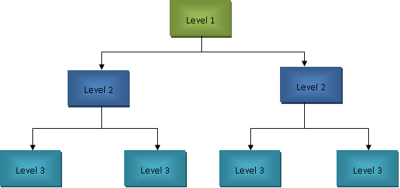

- [Oracle SQL](#oracle-sql)
  - [HDBMS](#hdbms)
  - [NDBMS](#ndbms)
  - [RDBMS](#rdbms)
  - [Installation](#installation)
    - [Ubuntu 20.04 Installation](#ubuntu-2004-installation)
      - [Oracle 11g-xe installation](#oracle-11g-xe-installation)
      - [Oracle SQLDeveloper Installation](#oracle-sqldeveloper-installation)
    - [Windows 10 Installation.](#windows-10-installation)
      - [Oracle 10g Installation](#oracle-10g-installation)
      - [Oracle 11g-xe Installation](#oracle-11g-xe-installation-1)
      - [Windows SQLDeveloper installation](#windows-sqldeveloper-installation)
    - [SQLPlus](#sqlplus)
      - [Oracle 10g SQLPlus Useful Commands](#oracle-10g-sqlplus-useful-commands)
  - [SQL](#sql)
    - [History](#history)
    - [DDL(Data Definition Language)](#ddldata-definition-language)
      - [CREATE](#create)
        - [TABLE](#table)
        - [DATABASE](#database)
      - [ALTER](#alter)
        - [ADD](#add)
        - [MODIFY](#modify)
        - [COLUMN](#column)
      - [TRUNCATE](#truncate)
      - [RENAME](#rename)
        - [TO](#to)
      - [DROP](#drop)
      - [Constraints](#constraints)
      - [Normalization](#normalization)
        - [First](#first)
        - [Second](#second)
        - [Third](#third)
        - [Fourth](#fourth)
    - [DML(Data Manipulation Language)](#dmldata-manipulation-language)
      - [INSERT](#insert)
        - [INTO](#into)
      - [UPDATE](#update)
      - [DELETE](#delete)
    - [DCL(Data Control Language)](#dcldata-control-language)
    - [DTL/TCL(Data Transaction Language/Transaction Control Language)](#dtltcldata-transaction-languagetransaction-control-language)
    - [DQL(Data Query Language)](#dqldata-query-language)

# Oracle SQL

**Data:**  
Data means Raw Facts or Details of an object.  
Data can be a number, symbol, character, word. Without context, Data has no meaning.  
Ex: Student test score is Data, Without context, we can't make use of this number effectively.

**Information:**  
Information is Data put into context.  
A piece of information provides meaning, Information can Change depending on need.  
Information can be Processed to get a better understand of it.  
Ex: Student average marks of a semester.

**Database**  
A database is a systematic collection of data, organized for better usability.  
A database makes managing and scaling the data easily.  
A spreadsheet is an example of a simple database, where each table is a part of the database.

**Database Management System(DBMS)**: is a software that is used to organize data in the database.

-   DBMS is used to communicate with the actual database.
-   DBMS can be considered a Concept, An Abstraction, and a hierarchical model.

There are three types of DBMS.

## HDBMS

HDBMS is the first type of DBMS, Developed in the mid-1950s this was the earliest software implementation of DBMS.

-   It works by storing each data record as a node, each node is connected hierarchically to another node, hence the name Hierarchical DBMS.
-   Here the root node is the entry point of the database.
-   The entire database can be visualized as a binary tree.
-   We insert data from the left side to the right side of the hierarchy, and always fill from the leftmost node to the rightmost node.
-   All the nodes are balanced first before inserting data into any other node, i.e each node should have two child nodes.

**Drawbacks**

-   The drawback of HDBMS is that it takes a lot of time to reach the last node of the database.
-   Another major drawback is that if the link between nodes is lost due to technical difficulties, it can't be accessed.  
     

## NDBMS

Network DBMS is an upgrade over the HDBMS.  
It was designed to overcome the drawbacks of HDBMS.

-   NDBMS has all the features of HDBMS.
-   To overcome the defects of HDBMS, in NDBMS each data node is connected to all other nodes.
-   So that even if we lose one link between two nodes, we can access it from another node's link.
-   This linking between all nodes is similar to that of a graph/network.
-   Ex: a network of five nodes will be interconnected with each other, So we can just reach any node in a single jump from the root node.

**Advantages**

-   the major advantage of this approach is that every node in the network is just one jump away from the root node which makes it super-fast to access the node.

**Drawbacks**

-   The major drawback is that as the nodes in the database increase the Complexity of the network also increases, this makes accessing the node difficult.
-   The processing power needed to access the node grows exponentially for every node added to the network.
-   Consider a database with million records, where each node is connected with each other node, this creates a congested network.  
     

## RDBMS

Relational DBMS is the latest iteration of DBMS proposed in the 1980s to mitigate the problems of NDBMS and it did.

-   In RDBMS we store data in the form of tables, even a single data(a record) is stored in a table.
-   **Entity:** is the table name.
-   **Attributes:** are the column names of the table.
-   **Record:** is one row of data in the table.
-   True power of RDBMS comes when we link two tables to create relations between them.
-   It is the most Dominate DBMS in the Software industry.

**Implementations**

-   There are many Implementations of RDBMS that are being used in the industry.
-   Some of them are Oracle database, MySQL(also owned by Oracle), PostgreSQL, MongoDB, etc.
-   Each RDBMS has its own pros and cons.
-   **Oracle Database** is the industry-standard RDBMS that is used for enterprise-level products.
-   **MySQL** is the open-source database that is mostly used by beginners and for small projects.
-   **PostgreSQL** is one of the upcoming databases that is used by startups for faster deployment.
-   In this tutorial, we are learning Oracle SQL 10g.
-   Currently, the latest Oracle database version is 20c, but many Big companies are still developing products using Oracle 10g, Oracle 11g-xe, Oracle 12g versions.
-   It is a good practice to learn everything about one oracle version then learn other versions as needed depending on the project and company.

## Installation

To use Oracle SQL we need a database and an interface to communicate with that database.

Below are few available options to learn Oracle SQL

-   In a web version, officially provided by oracle on [https://livesql.oracle.com/](https://livesql.oracle.com/)
-   Installing on a VM/docker and connecting it via SSH or HTTPS to work with it. (this is good for experimentation)
-   Installing on your local machine just like other software and work with it. (Preferred)

Currently, in this guide, I provide instructions on Installing oracle 11g-xe on ubuntu 20.04 and oracle 10g installation on windows 10.

### Ubuntu 20.04 Installation

Software needed to use oracle 11g-xe in ubuntu 20.04.

1. Oracle JDK 8 or higher
1. Oracle 11g-xe software package
1. Latest version of SQLDeveloper Client

The JDK must be Oracle JDK only, OpenJDK 8 or any other JDK will not have some libraries bundled with them.  
These libraries are needed for the good working of the SQLDeveloper.  
So to avoid any hassle just install Oracle JDK 11 from [here](https://www.oracle.com/in/java/technologies/javase-jdk11-downloads.html).

#### Oracle 11g-xe installation

-   Download the _oracle 11g Linux zip_ file from [https://www.oracle.com/in/database/technologies/xe-prior-releases.html](https://www.oracle.com/in/database/technologies/xe-prior-releases.html)
-   `unzip oracle-xe-11.2.0-1.0.x86_64.rpm.zip` to extract the contents of the file, this will give us an rpm file, which can't be installed in ubuntu.
-   So we convert rpm to deb, which can be installed in ubuntu.
-   `Sudo apt-get install alien libaio1 unixodbc` to install required packages for converting rpm to deb.
-   convert rpm file to deb file with `cd Disk1` `sudo alien --scripts -d oracle-xe-11.2.0-1.0.x86_64.rpm`
-   Now we will get a deb package that can install oracle 11g, but before installing it we need to set up some environment properties.
-   `sudo nano /sbin/chkconfig` and add these lines to that file.

```bash
#!/bin/bash
# Oracle 11gR2 XE installer chkconfig hack for Ubuntu
file=/etc/init.d/oracle-xe
if [[ ! `tail -n1 $file | grep INIT` ]]; then
echo >> $file
echo '### BEGIN INIT INFO' >> $file
echo '# Provides: OracleXE' >> $file
echo '# Required-Start: $remote_fs $syslog' >> $file
echo '# Required-Stop: $remote_fs $syslog' >> $file
echo '# Default-Start: 2 3 4 5' >> $file
echo '# Default-Stop: 0 1 6' >> $file
echo '# Short-Description: Oracle 11g Express Edition' >> $file
echo '### END INIT INFO' >> $file
fi
update-rc.d oracle-xe defaults 80 01
```

-   Provide this file appropriate permissions. `sudo chmod 755 /sbin/chkconfig`
-   Oracle 11g needs access to kernel to run, create a file `sudo nano /etc/sysctl.d/60-oracle.conf` and add the following lines in it.

```bash
# Oracle 11g XE kernel parameters
fs.file-max=6815744
net.ipv4.ip_local_port_range=9000 65000
kernel.sem=250 32000 100 128
kernel.shmmax=536870912
```

-   Run the oracle service with `sudo service procps start`
-   verify that the file and service properties are correct.
-   `sudo cat /etc/sysctl.d/60-oracle.conf`, `sudo sysctl -q fs.file-max`.
-   The file-max value in 60-oracle.conf and the output max value should match. If not then a reboot should fix the problem.
-   setup a mount point for the database by creating `sudo nano /etc/rc2.d/S01shm_load`, paste these lines in the file.

```bash
#!/bin/sh
case "$1" in
start) mkdir /var/lock/subsys 2>/dev/null
       touch /var/lock/subsys/listener
       rm /dev/shm 2>/dev/null
       mkdir /dev/shm 2>/dev/null
       mount -t tmpfs shmfs -o size=2048m /dev/shm ;;
*) echo error
   exit 1 ;;
esac
```

-   provide permissions to this file `sudo chmod 755 /etc/rc2.d/S01shm_load`
-   create files with `sudo mkdir /var/lock/subsys` ,`sudo touch /var/lock/subsys/listener`.
-   Now **Must reboot** the system, this will get all the data and permissions ready for oracle 11g-xe installation.
-   go to the folder with oracle .deb file and type this in a terminal `sudo dpkg --install oracle-xe_11.2.0-2_amd64.deb`.
-   after done installing, provide the setup with current environment properties `sudo /etc/init.d/oracle-xe configure`
-   Few questions will be asked while configuring the installation. This is an important part, note all the details for future use.
-   give the first two options with default values by hitting enter twice.
-   Then it will ask for a root password of the database, the root user is **'sys' or 'sysdba'**, the password should be valid and strong. Remember the password. (sysdba/pass)
-   hit no, when asked to start oracle on the boot of the system.
-   Now link the oracle shell to our actual shell.
-   `nano ~/.bashrc` paste these lines at the end of the file(**Don't delete existing code**)

```bash
# oracle database properties
export ORACLE_HOME=/u01/app/oracle/product/11.2.0/xe
export ORACLE_SID=XE
export NLS_LANG=`$ORACLE_HOME/bin/nls_lang.sh`
export ORACLE_BASE=/u01/app/oracle
export LD_LIBRARY_PATH=$ORACLE_HOME/lib:$LD_LIBRARY_PATH
export PATH=$ORACLE_HOME/bin:$PATH
```

-   update the permission with `. ~/.bashrc`
-   start the oracle service `sudo service oracle-xe start`
-   Add the current system user account to the oracle dba user group, this makes accessing the service possible.
-   `sudo usermod -a -G dba <YOURUSERNAME>`.
-   Oracle 11g installation is now done

**User Creation**

-   To use the database, make sure the service started correctly with `sudo service oracle-xe start`.
-   log in to the oracle shell with `SQLPlus sys as sysdba`, this is the root account so be careful what operations you perform.
-   Enter the root password(pass), this is the same password we gave before.
-   So to avoid any catastrophic failures, it is preferred to create a non-root account for all database actions.
-   Only use the root account for emergencies and management.
-   create a new user `create user <USERNAME> identified by <PASSWORD>;`(t/0000).
-   then grant the appropriate permission you need on this account.

```SQL
grant create a session, grant any privilege to t;
grant unlimited tablespace to t;
grant create a table to t;
grant connect, a resource to t;
```

-   exit the shell with `exit;` and connect with a new user account and practice the SQL.

**Usage**

Oracle 11g can be used from the default terminal, SQLPlus terminal, SQL developer tool(GUI).  
It is preferred to first learn in terminal/SQLPlus, after mastering it move on to GUI for easy use.

-   Connect to user account with `SQLPlus t/0000`, this account has enough permissions to use the database without restrictions.
-   Remember there is no sample data available on this database(Oracle 11g-xe) to practice.
-   So we need to create them on our own.

#### Oracle SQLDeveloper Installation

While the Database we are using is Oracle 11g-xe(old version), we can still use the latest SQLDeveloper without any problems.

-   Download the latest version of **SQLDeveloper for other platforms zip file** from [https://www.oracle.com/tools/downloads/sqldev-downloads.html](https://www.oracle.com/tools/downloads/sqldev-downloads.html).
-   As mentioned above we need oracle JDK 8 or newer installed for this to work correctly.
-   If Followed the guide correctly, we would already have JDK 11.
-   Extract the zip to opt directory with `cd /opt`, `sudo unzip ~/Downloads/SQLDeveloper-20.2.0.175.1842-no-jre.zip`.
-   Now all the files of SQLDeveloper zip are copied to /opt/SQLDeveloper directory, verify that with `ls /opt/SQLDeveloper`.
-   We need to link the JDK path to the SQL developer executable.
-   Copy the path of java JDK, in ubuntu the path is similar to `/usr/lib/JVM/JDK-11.0.9/`.
-   Run `./SQLDeveloper.sh` file from /opt/SQLDeveloper directory.
-   If asked for the JDK path paste the above path.

**Create a Shell Shortcut**

-   run `sudo ln -s /opt/SQLDeveloper/SQLDeveloper.sh /usr/local/bin/SQLDeveloper`
-   Run `SQLDeveloper`, in any terminal.
-   We may get an error, as the file SQLDeveloper.sh has a relative path to SQLDeveloper executable.
-   To fix this we need to change the executable path from relative to absolute.
-   edit the file `sudo nano /opt/SQLDeveloper/SQLDeveloper.sh`, contents of the file should be similar to the below code.

```bash
#!/bin/bash
#cd "`dirname $0`"/SQLDeveloper/bin && bash SQLDeveloper $*
/opt/SQLDeveloper/SQLDeveloper/bin/SQLDeveloper $*
```

-   now try running `SQLDeveloper` in the terminal, this will launch the software without any errors.

**Create a DashBoard/Desktop Shortcut**

-   Now let's create a desktop shortcut to launch the software from GUI.
-   run `Sudo nano /usr/share/applications/SQLDeveloper.desktop` and paste these lines to create a shortcut

```bash
[Desktop Entry]
Name=Oracle SQL Developer
GenericName=SQL Tool
Exec=/usr/local/bin/SQLDeveloper
Icon=/opt/SQLDeveloper/icon.png
Type=Application
StartupNotify=true
Categories=Development;
```

-   That's it the SQLDeveloper is installed properly and can be used with the desktop shortcut.

### Windows 10 Installation.

#### Oracle 10g Installation

Oracle 10g is an Old, Legacy DBMS designed to work on Windows XP and Windows 7, which means we have to turn on the compatibility mode to install on Windows 10 and newer versions.

1. Extract the oracle 10g archive and run the Oracle Universal Installer.
2. Using this we can Install and Uninstall Oracle DBMS tools.
3. Click on install to install or uninstall components.
4. By default the software will be installed in the root directory of the drive (Ex: C:\ or D:\).
5. Create a directory to hold the DBMS components for ease of use (C:\oracle_installation)
6. At the beginning of the installation, it will ask to set up the password for the database (DatabaseName:orcl, Password: tiger)
7. Installer will ask for network access to use DBMS with JDBC and other Command-line tools. Allow it
8. Installer will Copy all the database files to the specified location and installs them, this takes about 10 minutes.
9. A popup with password management information is raised, click on Scott and hr to unlock them.
10. Add password for both accounts and confirm it(Scott: tiger, hr: tiger)
11. These are Default users which have all writes over the data they have.
12. Whereas sys/sysdba is the root user.
13. To connect we use `connect sys as sysdba` and provide the root password from command prompt or PowerShell.
14. At the end of the installation the installer tries to connect to the database service using HTTP (`http://T-Windows:5560/iSQLPlus/dba`).
15. This service URL is used by command-line tools and programming languages to connect to the database.
16. Since this software is a legacy version, we need to change the compatibility mode to run on Windows XP, And always run with admin privileges as the database needs admin rights to function properly.

#### Oracle 11g-xe Installation

We **can** have Both Oracle 10g and Oracle 11g-xe installation in a single P.C but it can cause some problems.  
It is recommended to only install one version of one RDBMS on one PC.  
If we need another version of Oracle on the same PC, **try a Virtual box installation or Docker image**, but installing two Oracle versions on one PC is **not recommended**.  
**Just because we can doesn't mean we should.**

1. Search in google for oracle 11g windows installer download. Download the appropriate file from the oracle website.
2. Extract the contents of the zip file then click on the setup file.
3. It will ask for the path of installation, choose one or create your own folder to manage easily.
4. Installer will prompt you for a password of the root account give a good password and remember this for future uses. (Pass)
5. That's it after password confirmation, it will take around 5-20 minutes then the installation is done.
6. A shortcut is created on the desktop and start menu.
7. The user name is sys password is Pass(mine).
8. Using the shortcut we can use the Oracle 11g-xe database from a web interface, if it doesn't work search online for solutions.

#### Windows SQLDeveloper installation

To install SQLDeveloper in Windows 10, we need Oracle JDK 8 or higher, it is preferred to use Oracle JDK 11.

1. Download the SQLDeveloper latest version for your windows version from [https://www.oracle.com/tools/downloads/sqldev-downloads.html](https://www.oracle.com/tools/downloads/sqldev-downloads.html).
2. If you don't have JDK installed then download the JDK included version of SQLDeveloper
3. After downloading the file, extract the contents and copy them to C:\, there is no installation of the SQLDeveloper.
4. We just run the SQLDeveloper executable every time, so create an executable shortcut on the desktop.

### SQLPlus

SQLPlus is a bash based command-line interface provided by the Oracle installation, which can be used to connect to the DBMS.  
We can use other command-line tools to connect to the DBMS also.  
(OraDb10g_home1 is the service name given while installing Oracle)

We can use either the SQLPlus command line tool installed in windows 10 or use the command prompt/any preferred terminal and connect to SQLPlus using these commands.  
`SQLPlus username/password` i.e `SQLPlus scott/tiger`.

Only Oracle-specific commands will work in SQLPlus. Any commands of the actual terminal(like clear/cls/ls/dir) may disconnect us from the SQLPlus service.

To run native shell commands we use `host` as the prefix of the command.  
Ex: `host cls;` Here host gives the command to the native terminal instead of SQLPlus executing it, and cls is used to clear the terminal screen.

#### Oracle 10g SQLPlus Useful Commands

```SQL
/*
In SQLPlus each line is limited to display only 80 Characters,
if output/input is more than 80 it is wrapped to the next line.

In SQLPlus the output of each query is stored on a pagefile,
with a default size of 14 lines per page.

But we can change these using the following command.
*/
set pagesize 300 linesize 120

-- clears the pagefile which cleans the console screen.
clear screen;

-- Displays all tables that the current user has ACCESS to
select * from all_tables;
select * from all_all_tables;

-- Displays all tables that are OWNED by the current user
select * from tab;
select * from user_tables;

-- Display all users VISIBLE to the current user
select * from all_users;

-- Display CURRENT user information
select * from user_users;

-- To ACCESS system-level tables, we need a dba/sys account/Privileges.
-- be careful when using root account (or) dba account,
-- since this account has full control of the database.
connect sys as sysdba
-- prompts for the password

-- To connect with non-dba accounts use and enter a password
connect <username>

-- Disconnects the current user from the database session.
-- But SQLPlus won't terminate, we can start another session with a new user account.
disc

-- exits the SQLPlus editor completely.
exit
quit

-- displays the PRIVILEGES of current user
select * from user_sys_privs;
select * from user_tab_privs;
select * from user_role_privs;

-- Shows all the COLUMN NAMES of a table
desc <tablename>
describe <tablename>

-- Shows COLUMN NAMES and DATATYPE of each column in all tables.
select * from all_tab_columns;

-- Shows CONSTRAINTS of all tables of the current user
select * from user_cons_columns;

-- Shows CONSTRAINTS of all tables of all users
select * from all_constraints;


-- CRUD Operations

-- create
create table sdept(
                    branch varchar(30) primary key,
                    bname varchar(30) not null,
                    hod varchar(30)
                );
create table stu420(
                    rollno number(4) primary key,
                    sname varchar(20) not null,
                    totalmarks number(2),
                    branch references sdept(branch)
                );

-- rename
rename stu420 to a student;

-- insert new column
alter table student add(remakrs varchar(30));

--delete a column
alter table student drop remarks;

-- insert
insert into sdept values('cse','computers','csehod');
insert into student values(1,'somedude',99,'cse');

-- update
update student set marks=88 where sname='somedudecse';

-- grant
grant select on student to hr;

-- revoke
revoke select on student from hr;
```

## SQL

Pronounced as S.Q.L or see quel(SEQUEL) both are correct.

SQL stands for Structured Query Language used to communicate with RDBMS.  
Since it is not safe to use the RDBMS directly we communicate using SQL, which helps to provide a good abstraction.

### History

After the proposal of RDBMS, scientists and Software companies of industry started collaborating to create a common language that can be used to communicate with RDBMS.

This common language is called **SEQUEL** which stands for **Structured English QUEry Language**.

Later it was found that SEQUEL was already a trademark for another company making car engines.
Due to this, the name was changed from SEQUEL to **SQL(Structured Query Language)**.  
Today people from different regions call it either SQL OR SEQUEL, but both of them are correct so don't have to worry about it.

SQL become the standard of ANSI(American National Standards Institute) in 1986.  
SQL become the standard of ISO(Internation Organization of Standardization) in 1987.  
Each RDBMS that was designed and developed after this standardization, implements SQL, the syntax and commands differ between each RDBMS but the core concepts and standards are the same.  
These are called different versions of SQL or different flavors of SQL.

This makes learning SQL tough, but the base concepts will be the same in all RDBMS.  
So In this tutorial **understand and focus on the concepts** rather than the actual syntax.

Every RDBMS should perform 4 essential operations, they are collectively called **CRUD** Operations.

**CRUD**

1. _Create_: new databases, tables, views
2. _Read_: existing tables, databases
3. _Update_: records, tables, databases
4. _Delete_: records, columns, tables, databases

**Definition**  
SQL is the standard language to store, retrieve, manipulate data in RDBMS.

We use SQL to

-   Create Tables, Databases, Views.
-   Inserting records of data into tables.
-   Update existing records
-   Deleting existing records
-   Display (or) Retrieve the records in a table.

Oracle SQL is divided into five categories. They are

-   DDL(Data Definition Language)
-   DML(Data Manipulation Language)
-   DCL(Data Control Language)
-   DTL(Data Transaction Language)
-   DQL(Data Query Language)

### DDL(Data Definition Language)

Data Definition Language is used to perform operations that **define a database and table structure**.

-   DDL is rarely used and only by experienced people in an organization.
-   An Architect or a DBA(DataBase Administrator) takes care of DDL Commands.

Most perform operations in DDL are

1. Create
2. Alter
3. Rename
4. Truncate
5. Drop

> All SQL commands and keywords are typed in uppercase, it is not a rule, but a convention followed by all SQL programmers.  
> All other words and statements of SQL queries can be lowercase or uppercase.

#### CREATE

Create command is used to create databases and tables.

```SQL
CREATE DATABASE college;

CREATE TABLE students(
    ID PRIMARY KEY,
    Name VARCHAR(50) NOT NULL,
    Age INT NOT NULL,
    Branch VARCHAR(10) NOT NULL
);
```

##### TABLE

Table command is used to DDL Commands to specify the current operation should be perform on the table with given name.

```SQL
-- Here we are create a table with name "students".
CREATE TABLE students;

-- Modifying a table with name "students"
ALTER TABLE students;
```

##### DATABASE

Database command is used with DDL Commands to perform operations on a specific database.

```SQL
-- Creating a database with name "college"
CREATE DATABASE college;

-- Deleting a database with name "college"
DROP DATABASE college;
```

#### ALTER

Alter Command is used to alter tables, columns, and their metadata.

```SQL
-- Adds a new column to an existing table
ALTER TABLE students ADD email VARCHAR(255);

-- Renames existing column in a Table
ALTER TABLE students RENAME COLUMN email TO EmailAddress;

-- Change the Column constraints in a table
ALTER TABLE students MODIFY EmailAddress VARCHAR(100) NOT NULL;

-- Delete an entire column of a table
ALTER TABLE students DROP COLUMN EmailAddress;
```

##### ADD

Add command is used to add new constraints or columns to a table.  
This command is used with Alter command most of the time.

```SQL
-- adds a new column to a table
ALTER TABLE students ADD email VARCHAR(255);

-- adds a new constraint to an existing column
ALTER TABLE students ADD CONSTRAINT constraintname PRIMARY KEY (column1, column2);
```

##### MODIFY

Modify command is used to modify existing column type or constraint.

```SQL
-- modifies existing column constraints and datatype.
-- if any data is already present then an error is raised or
-- all the data in that column will be deleted.
ALTER TABLE students MODIFY email VARCHAR(100) NOT NULL;
```

##### COLUMN

Column command is used to apply the current operation on a specific column.  
Used in combination with ALTER, RENAME, UPDATE, DROP commands.

```SQL
-- renames specific column only.
ALTER TABLE students RENAME COLUMN email TO emailAddress;
```

#### TRUNCATE

The truncate command is used to delete all the data in a table leaving only the structure of the table.  
After truncating the data of a table, columns and their constraints and the relations of that table are only stored.

```SQL
-- deletes all the data in the table
TRUNCATE TABLE students;

-- deleting all the data in a single column is not possible with truncate
-- we use to delete for that
```

#### RENAME

Rename Command is used to rename the table or column name.

-   Used to change the name of Entity(table) or Field(column) or Attribute(Column).

```SQL
-- Rename a table
RENAME students TO studentdetails;
ALTER TABLE studentdetails RENAME TO students;

-- Rename a column
ALTER TABLE students RENAME COLUMN EmailAddress TO email;
```

##### TO

To command is used to provide the property or data to a specific table or column.  
Used with ALTER, RENAME, UPDATE commands most of the time.

```SQL
-- changes table name from studentdetails to students.
ALTER TABLE studentdetails RENAME TO students;
```

#### DROP

Drops/Deletes an entire Database or table or column, without any structure left behind like TRUNCATE.

-   Have to be Careful when Dropping tables.
-   Most of the time **only Admins** get to **drop data**.
-   When a column or table is dropped all the data in it is deleted then the constraints and relations of that column and table are removed from the database.
-   Once dropped **can't get the data back** without a proper backup of the entire table/database.
-   Never Drop anything unless ready to deal with the aftermath.

```SQL
-- Drop Column
ALTER TABLE students DROP COLUMN email;

-- Drop-Table
DROP TABLE students;

-- Drop View
DROP VIEW viewname;

-- Drop Database
DROP DATABASE college;
```

#### Constraints

To operate a database with good DDL operations we need knowledge of All the constraints of Oracle SQL.

In Oracle SQL we have several Constraints depending on the Normalization level we use one or more.

There are two parts of Constraint.  
First part of Constraint is providing the datatype accepted by a single column.

Datatypes supported in SQL are

-   NUM
-   INT
-   DATE
-   VARCHAR
-   VARCHAR2
-   TIME
-   FLOAT

The second part of constraint is the restrictions put on each column, these make our table less prone to error with a good type checking.

The restrictions available in Oracle SQL are

-   NULL
-   NOT NULL
-   UNIQUE
-   PRIMARY KEY
-   FOREIGN KEY

#### Normalization

Normalization is the concept of designing the database with necessary features and guidelines.  
There are four types of normalizations. they are

-   first rule
-   second rule
-   third rule
-   fourth rule

depending on the database and project we follow one rule

##### First

##### Second

##### Third

##### Fourth

### DML(Data Manipulation Language)

Data Manipulation Language is used to modify existing database and table data.

With DML we can perform operations like

-   INSERT
-   UPDATE
-   DELETE

#### INSERT

INSERT Command is used to insert data/records in to a table.  
Commonly we use INTO command with INSERT command.

```SQL
/*
    Column details:

    ID PRIMARY KEY,
    Name VARCHAR(50) NOT NULL,
    Age INT NOT NULL,
    Branch VARCHAR(10) NOT NULL
*/
-- Inserts data into students table , the order matters.
INSERT INTO students VALUES(001,'Earth',20,'Computers');

-- Inserts data into students table, with custom order as we give.
INSERT INTO students (Age,Branch,Name,ID) VALUES (21,'Electronics','Mars',002);

-- We can skip some columns if the column accepts null values,
-- but here we have to specify which columns we are providing data for.
INSERT INTO students (ID,Name,Branch) VALUES (003,'Jupiter','Computers');
```

##### INTO

Into is a command used mostly with INSERT command to insert data **into a table**.

```SQL
-- Without Into command we can't put data in the table.
INSERT INTO students VALUES (001,'Earth',20,'Computers');
```

#### UPDATE  

#### DELETE  

### DCL(Data Control Language)

DCL is used to provide permissions to other users of database access to our tables. - Statements supported are - GRANT - REVOKE

### DTL/TCL(Data Transaction Language/Transaction Control Language)

DTL is used to save the info to the database after editing it. - Statements supported are - COMMIT - SAVEPOINT - ROLLBACK -

### DQL(Data Query Language)

DQL is used to query the data already present in the database. This is the Most used SQL part, we use this to get existing data, modify the data according to our need(read-only). - Statements supported are - SELECT - FROM - WHERE - GROUP BY - ORDER BY - JOIN - ON - DISTINCT - HAVING

Keywords in SQL:

1. **IN**: used to find the values that are exact match easy to write than multiple equal conditions and or

```sql
select * from emp where sal = 1000 or sal = 2000 or sal = 3000;
-- multiple equal and or statements
select * from emp where sal in (1000,2000,3000);
-- same as above but is easy to write
```

2. **BETWEEN AND**: These keywords are used to take and filter data between a range of values, this is an extended version of IN.

```SQL
select * from emp where sal>=1000 and sal<=3000;
-- takes salary between 1000 and 3000
select * from emp where sal between 1000 and 3000;
-- same as above but easy to write and understand
```

3. **ALL**: All keyword is used to filter data based on multiple and condition on a single column. This is mostly used to take data from an array and filter data.

```SQL
select * from emp where sal>1000 and sal>2000 and sal>3000;
-- here we will only get salaries that are greater than 3000, as only those values satisfy all the values.
select * from emp where sal > ALL(1000,2000,3000);
-- same as above shorter

sal >= all(1000,2000,3000)
-- returns values from 3000 onwards
sal < all(1000,2000,3000)
-- returns values less than 1000, i.e 999 onwards
sal <= all(1000,2000,3000)
-- returns values from 1000,999 onwards

sal = all(1000,2000,3000)
-- returns no values as no single person can earn 1000 and 2000 dollars at the same time

sal != all(1000,2000,3000)
-- returns values that are not exactly these value so 1001 and 1999 will be shown.

sal <> all(1000,2000,3000)
-- same as above command, it is another symbol for not equal to in oracle

-- all is another extension for between and
```

4. **ANY** Any keyword is an extension of all keywords, it checks multiple or conditions on multiple comparisons.

```SQL
select * from emp where sal>1000 or sal >2000 or sal > 3000;
-- here only salaries greater than 1000 are shown as all other conditions are satisfied by it

select * from emp where sal > ANY(1000,2000,3000);
-- same as above checks sal for 1000 if true prints the value as in or if one condition is true all conditions are true.
-- for 900 sal it checks 1000 fails so checks 2000, fails so checks 3000 fails and doesn't print.
-- data doesn't have to be sorted or given manually, can also be taken from an array.

-- This is the most generalized output command
-- we can perform in operation using any

select * from emp where sal = ANY(1000,2000,3000);
-- performs same as sal in (1000,2000,3000)
```
