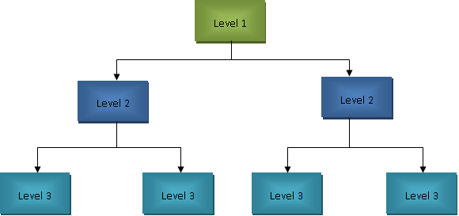

# Oracle SQL

**Data**: Information about some facts.  
**Database**: Collection of Information that makes sense when used together and can analyze it for a better understanding of it.  
**Database management system(DBMS)**: is a software that is used to organize data in the database.

- DBMS is used to communicate to the actual database.  
- DBMS can be considered a Concept, An Abstraction, and a hierarchical model.

There are three types of DBMS.

## HDBMS  

HDBMS is the first type of DBMS, Developed in the mid-1950s this was the earliest software implementation of DBMS.
- It works by storing each data record as a node, each node is connected hierarchically to one another, hence the name Hierarchical DBMS.  
- Here the root node is the entry point of the database.  
- The entire database can be visualized as a binary tree.  
- We insert data from left to right of leftmost node to rightmost node.  
- All the nodes are balanced first before inserting data into any other node, i.e each node should have two child nodes.  

**Drawbacks**  
- The drawback of HDBMS is that it takes a lot of time to reach the last node of database.  
- Another major drawback is that if the link between nodes is lost due to technical difficulties, it can't be accessed. 
  

## NDBMS  

Network DBMS is an upgrade over the HDBMS.  
It was designed to overcome the drawbacks of HDBMS.  

- NDBMS has all the features of HDBMS.  
- To overcome the defects of HDBMS, in NDBMS each data node is connected to all other nodes.  
- So that even if we loose one link between two nodes, we can access it from other node.  
- This linking between all nodes is similar to that of a graph/network.  
- Ex: a network of five nodes will be interconnected with each other, So we can just reach any node in a single jump from the root node.  

**Advantages**  
- the major advantage of this approach is that every node in the network is just one jump away from the root node which makes it super-fast to access the node.  

**Drawbacks**  
- The major drawback is that, the Complexity of the network makes accessing the node becomes congested.  
- The processing power needed to access the node grows exponential for every node added to the network.  
- Consider a database with million records, here each node is connected with each other node, this creates a congested network.  
  

## RDBMS  

Relational DBMS is the latest iteration of DBMS proposed in 1980 to mitigate the problems of NDBMS and it did.  

- In RDBMS we store data in the form of tables, even a single data(record) is stored as an item in a table.  
- **Entity:**  is the table name.  
- **Attributes:** are the column names of table.
- **Record:** is one row of data in the table.  
- True power of RDBMS comes when we link two tables to create relations between them.
- It is the most Dominate DBMS in the Software industry.  

**Implementations**  
- There are many Implementations of RDBMS that are being used in the industry.  
- Some of them are Oracle database, MySQL(oracle owned), PostgreSQL, MongoDB.  
- Each RDBMS with their own pros and cons.  
- **Oracle Database** is the industry standard RDBMS that is used for enterprise level products. 
- **MySQL** is the opensource database that is mostly used by beginners to learn and experiment.  
- **PostgreSQL** is one of the upcoming database that is used by startups for faster deployment and flexibility.  
- In this tutorial we are learning Oracle SQL 10g.  
- Currently the latest Oracle database version is 20c, but many Big companies are still developing products using Oracle 10g, Oracle 11g-xe, Oracle 12g versions.  
- It is a good practice to learn every thing of one oracle version then learn as needed depending on the project and company.  

## Installation  

To use Oracle SQL we need a database and an interface to communicate with that database.  

Few of the options to use Oracle SQL to learn are  

- In a web version, officially provided by oracle on [https://livesql.oracle.com/](https://livesql.oracle.com/)
- Installing on a vm/docker and connecting it via ssh or https to work with it.(this is good for experimentation)  
- Installing on your local machine just like an another software and work with it.(Preferred)  

Currently Iam focusing on Installing oracle 11xe on ubuntu 20.04 and windows 10.  

### Ubuntu 20.04 Installation  

We need to softwares to use oracle 11g-xe in ubuntu 20.04.  
1. Oracle 11g-xe software package
2. Sqldeveloper latest version

To successfully complete the installation of both softwares we need oracle java 8 or above.  
This java jdk must be oracle's only, openjdk 8 or above doesn't have some libraries installed by default with them.  
So avoid any hasell and install oracle java jdk 11 from [here](https://www.oracle.com/in/java/technologies/javase-jdk11-downloads.html).  


#### **Oracle 11g-xe installation(ubuntu)**  

- First download oracle 11xe for ubuntu from [https://www.oracle.com/in/database/technologies/xe-prior-releases.html](https://www.oracle.com/in/database/technologies/xe-prior-releases.html)  
- Download the oracle 11g linux zip file.  
- `unzip oracle-xe-11.2.0-1.0.x86_64.rpm.zip` to extract the file, this will give us a rpm file, which can't be installed in ubuntu.  
- So we convert rpm to deb, which can be installed in ubuntu.  
- `sudo apt-get install alien libaio1 unixodbc` to install required packages.  
- convert rpm file to deb file with `cd Disk1` `sudo alien --scripts -d oracle-xe-11.2.0-1.0.x86_64.rpm`  
- Now we got the deb package to install oracle 11g, but before installing it we need to setup some environment properties.  
- `sudo nano /sbin/chkconfig` and add these lines to that file.  
```bash
#!/bin/bash
# Oracle 11gR2 XE installer chkconfig hack for Ubuntu
file=/etc/init.d/oracle-xe
if [[ ! `tail -n1 $file | grep INIT` ]]; then
echo >> $file
echo '### BEGIN INIT INFO' >> $file
echo '# Provides: OracleXE' >> $file
echo '# Required-Start: $remote_fs $syslog' >> $file
echo '# Required-Stop: $remote_fs $syslog' >> $file
echo '# Default-Start: 2 3 4 5' >> $file
echo '# Default-Stop: 0 1 6' >> $file
echo '# Short-Description: Oracle 11g Express Edition' >> $file
echo '### END INIT INFO' >> $file
fi
update-rc.d oracle-xe defaults 80 01
```  

- Provide this file appropriate permissions. `sudo chmod 755 /sbin/chkconfig`  
- Oracle 11g needs kernel permission to run, create a file and paste this code in this.  
- `sudo nano /etc/sysctl.d/60-oracle.conf`  
```bash
# Oracle 11g XE kernel parameters  
fs.file-max=6815744  
net.ipv4.ip_local_port_range=9000 65000  
kernel.sem=250 32000 100 128 
kernel.shmmax=536870912 
```  

- Now start these kernel permissions `sudo service procps start`
- verify the file and kernel permissions are correct.  
- `sudo cat /etc/sysctl.d/60-oracle.conf`, `sudo sysctl -q fs.file-max`.  
- The file-max value in 60-oracle.conf and the output max value should match. If not then a reboot should fix the problem.  
- setup a mount point for the database to connect to shell.  
- create file `sudo nano /etc/rc2.d/S01shm_load`, paste these lines in it  

```bash
#!/bin/sh
case "$1" in
start) mkdir /var/lock/subsys 2>/dev/null
       touch /var/lock/subsys/listener
       rm /dev/shm 2>/dev/null
       mkdir /dev/shm 2>/dev/null
       mount -t tmpfs shmfs -o size=2048m /dev/shm ;;
*) echo error
   exit 1 ;;
esac 
```  

- provide permissions to this file `sudo chmod 755 /etc/rc2.d/S01shm_load`  
- create links to files `sudo mkdir /var/lock/subsys` ,`sudo touch /var/lock/subsys/listener`.  


- reboot the system now(must), this will get all the data and permissions ready for oracle actual installation.  
- go to the oracle folder and type this in a terminal `sudo dpkg --install oracle-xe_11.2.0-2_amd64.deb`.  
- after done installing, provide the setup with current environment properties `sudo /etc/init.d/oracle-xe configure`  
- Few questions will be asked while configuring the installation. This is an important part, note all the details for future use.  
- give first two options default values by hitting enter twice.  
- Then it will ask for a root password of the database, the root user is 'sys' or 'sysdba', password should be valid and strong. Remember this. (sysdba/pass)  
- hit no, when asked to start oracle on boot of system.  
- Now link oracle shell to our actual shell.  
- `nano ~/.bashrc` paste these lines at the end of the file  
```bash
# oracle database properties 
export ORACLE_HOME=/u01/app/oracle/product/11.2.0/xe
export ORACLE_SID=XE
export NLS_LANG=`$ORACLE_HOME/bin/nls_lang.sh`
export ORACLE_BASE=/u01/app/oracle
export LD_LIBRARY_PATH=$ORACLE_HOME/lib:$LD_LIBRARY_PATH
export PATH=$ORACLE_HOME/bin:$PATH
```  

- update the permission with `. ~/.bashrc`
- start the oracle service `sudo service oracle-xe start`  
- Add current user account to the oracle dba user group, this makes accessing the service possible. 
- `sudo usermod -a -G dba <YOURUSERNAME>`.  
- Oracle 11g installation is now done  

**User Creation**  

- To use the database, make sure the service started correctly with `sudo service oracle-xe start`.  
- login the shell with `sqlplus sys as sysdba`, this is the root account so be careful what operations you perform.  
- Enter the root password(pass), this is the same password we gave before.  
- So to avoid any catestrophic failures, it is preferred to create a non root account for all database actions. 
- Only use root account for emergency and managements.  
- create a new user `create user t identified by 0000;` while using sqlplus.  
- then grant appropriate permission you need on this account. 
```sql
grant create session, grant any privilege to t;
grant unlimited tablespace to t;
grant create table to t;
grant connect, resource to t;
```  

- exit the shell with `exit;` and connect with new user account and practice the sql.

**Usage**  

Oracle 11g can be used from default terminal, sqlplus terminal, sqldeveloper tool(gui).  
It is preferred to first learn in terminal/sqlplus, after mastering it move on to gui for easy use.  

- Connect to user account with `sqlplus t/0000`, this account has enough permissions to use database without restrictions.  
- Remember there is no sample data available on this database(Oracle 11g-xe) to practice.  
- So we need to create them on our own.


#### Oracle sqldeveloper(Ubuntu) Installation

While Database we are using is Oracle 11g-xe, we can use the latest SqlDeveloper with out any problems.  

- Download the latest version of sqldeveloper from [https://www.oracle.com/tools/downloads/sqldev-downloads.html](https://www.oracle.com/tools/downloads/sqldev-downloads.html), download the other platforms zip file.  
- As mentioned above we need oracle jdk 11 or newer installed for this to work correctly.  
- Extract the zip to opt directory with `cd /opt`, `sudo unzip ~/Downloads/sqldeveloper-20.2.0.175.1842-no-jre.zip`.  
- Now all the files of sqldeveloper zip are copied to /opt/sqldeveloper directory, verify that with `ls /opt/sqldeveloper`.  
- Now link the java jdk path to sqldeveloper executable.  
- Copy the path of java jdk, in ubuntu the path is similar to `/usr/lib/jvm/jdk-11.0.9/`.  
- Run `./sqldeveloper.sh` file.  
- If asked for the jdk path paste the above path.  

**Create a Shell Shortcut**  

- run `sudo ln -s /opt/sqldeveloper/sqldeveloper.sh /usr/local/bin/sqldeveloper`  
- Run `sqldeveloper`,in any terminal.  
- We may get an error, as the file sqldeveloper.sh has a relative path to sqldeveloper.
- To fix this we need to change the executable path to absolute.  
- run `sudo nano /opt/sqldeveloper/sqldeveloper.sh` 
- edit the file to look like this and save it.  

```bash
#!/bin/bash
#cd "`dirname $0`"/sqldeveloper/bin && bash sqldeveloper $*
/opt/sqldeveloper/sqldeveloper/bin/sqldeveloper $*  
```

- now try running `sqldeveloper` in terminal, this will launch the software without any errors.

**Create a DashBoard/Desktop Shortcut**  

- Now lets create a desktop shortcut to launch the software from gui.  
- run `sudo nano /usr/share/applications/sqldeveloper.desktop` and paste these lines to create a shortcut

```bash
[Desktop Entry]
Name=Oracle SQL Developer
GenericName=SQL Tool
Exec=/usr/local/bin/sqldeveloper
Icon=/opt/sqldeveloper/icon.png
Type=Application
StartupNotify=true
Categories=Development;
```  

- Thats it the sqldeveloper is installed properly and can be used with desktop shortcut.

## SQL  

**SQL**: Pronounced as S.Q.L or see quel(SEQUEL) both are correct.  

SQL is a Structured programming language used to communicate to our DBMS software. Since the DBMS software manages the database, it is not safe to open it to anyone who wants to access it.
So Many industry leaders/enthusiasts created a common language so that any implementation of RDBMS can be used with it.
This was Standard English Query Language or SEQUEL pronounced see-quel but later found that it was already a trademark for another company making car engines.
So
They changed the name to SQL(Structured Query Language). pronounced S-Q-L or See-quel.Its user preference

SQL is just a syntax/format that database developers need to implement in their respective DBMS software.

Most RDBMS software support all standard SQL features but each software have their own implementations and syntax/flavor of SQL.  
This makes learning multiple databases tough.
but the base concepts will be the same in many software.
So In this tutorial understand the concepts more than the actual syntax.

SQL is divided into 5 Language parts depending on the task they perform:

1. DDL: Data Definition Language is used to create, alter the structure of a table for later use.
    - This language is rarely used, only to create a table, but in most cases, it would be done already by many database architects, So just need to be aware of them.
    - This language performs the following statements.
    - CREATE
    - ALTER
    - TRUNCATE
    - RENAME
    - DROP
2. DML: Data Manipulation Language is used to make modifications to an existing table.
    - This is most helpful when we made mistakes while creating a database/table so we can change them easily.
    - Statements supported by DML are:
    - INSERT
    - UPDATE
    - DELETE
3. DCL: DCL is used to provide permissions to other users of database access to our tables.
    - Statements supported are
    - GRANT
    - REVOKE
4. TCL/DTL: Data Transaction Language/Transaction Control Language is used to save the info to the database after editing it.
    - Statements supported are
    - COMMIT
    - SAVEPOINT
    - ROLLBACK
5. DQL: Data Query Language is used to query the data already present in the database. This is the Most used SQL part, we use this to get existing data, modify the data according to our need(read-only).
    - Statements supported are
    - SELECT
    - FROM
    - WHERE
    - GROUP BY
    - ORDER BY
    - JOIN
    - ON
    - DISTINCT
    - HAVING

**Oracle Sqlplus 10g Installation**

Oracle 10g is an Old, Legacy DBMS designed to work on Windows XP and Windows 7, which means we have to turn on the compatibility mode to install on Windows 8 and new versions.

1. Extract the archive and run the Oracle Universal Installer.
2. Using this we can Install and Uninstall Oracle DBMS tools.
3. Click on install to install components, click on installed software to uninstall components.
4. By default the software will be installed in the root directory of the drive (Ex: C:\ or D:\).
5. Create a directory to hold the installation components for ease of use (C:\oracle_installation)
6. At the beginning Installer will ask for the password for the root database (orcl: database, tiger: password)
7. Installer will ask for network access to use this DBMS with JDBC and other Command-line tools. Allow it
8. Installer will Copy all the database files to the specified location and installs them, takes about 10 minutes.
9. Here A prompt is given to the user which gives information about password management. click on two users Scott and hr unlock them.
10. Add password for both accounts and confirm it(Scott, hr:tiger: password)
11. These are Default users which have all writes over the data they have.
12. Whereas sys/sysdba is the root user.
13. To connect we use `connect sys as sysdba` and provide the root password.
14. At the end of the installation the installer tries to connect to the database service using HTTP (`http://T-Windows:5560/isqlplus/dba`).
15. This service URL is used by command-line tools and programming languages to connect to the database.
16. Since this software is a legacy version, we need to change the compatibility mode to run on Windows XP, And always run with admin privileges as the database needs admin rights to function properly.

**Sqlplus** is a bash like tool with a command line interface provided by the oracle 10g to connect to the DBMS.  
We can use other command-line tools to connect to the oracle database service also.  
(Service name while installing oracle is Oracle home OraDb10g_home1)

Oracle Sqlplus is a bash implementation that can be used with any other shell over the network with admin privileges.  
This can make for more easy use with existing workflow. All we need is the command to connect to the oracle service.  
`sqlplus username/password` i.e `sqlplus scott/tiger`.  
This connects you to the sqlplus shell and only those commands work in it. Any command clearing the shell contents will disconnect from the service.

To Clear the screen, we use `clear screen;` in sqlplus, but other shells like cmd or PowerShell will disconnect from the sqlplus connection.  
To clear screen or run native shell command use host as the prefix of command. Ex: `host cls;` cls clears screen normally host gives the command to the native shell instead of sqlplus executing it.

**Details about Oracle SqlPlus Editor 10g shell**

```SQL
/*
a page size is a group of output lines that are stored in temporary memory. default is 14 lines
linesize is several characters to be displayed in a single line similar to word wrap.
default is 80 characters. We change this depending on our needs.
*/
set pagesize 2000 linesize 2000

-- clears the temporary memory buffer which cleans the console screen.
clear screen;

-- Displays all tables that the current user has access to
select * from all_tables;
select * from all_all_tables;


-- Display tables that are owned by the current user
select * from tab;
select * from user_tables;

-- View all users visible to the current user
select * from all_users;

-- View current user information
select * from user_users;

-- To access dba or system-level tables or data you need a dba/sys account to access them.
-- asks for the password of the root user.
-- be careful when using this user as this controls the entire database.
connect sys as sysdba

-- connect with other accounts in the same shell
-- prompts for the password
connect <username>

-- logs off the current user from database session but sqlplus still works for another login using connect
disc

-- exits the surplus editor completely.
exit
quit

-- displays the privileges of current user
select * from user_sys_privs;
select * from user_tab_privs;
select * from user_role_privs;

-- displays the column names of a table
desc <tablename>
describe <tablename>

-- display the column name and their datatype table
select * from all_tab_columns;

-- view constraints of all tables of the current user
select * from user_cons_columns;

-- view constraints of all tables of all users
select * from all_constraints;

-- create
create table sdept(branch varchar(30) primary key,bname varchar(30) not null,hod varchar(30));
create table stu420(rollno number(4) primary key,sname varchar(20)
not null,totalmarks number(2),branch references sdept(branch));

-- rename
rename stu420 to a student;

-- insert new column
alter table student add(remakrs varchar(30));

--delete a column
alter table student drop remarks;

-- insert
insert into sdept values('cse','computers','csehod');
insert into student values(1,'somedude',99,'cse');

-- update
update student set marks=88 where sname='somedudecse';

-- grant
grant select on the student to hr;

-- revoke
revoke select on a student from hr;
```


Keywords in SQL:
1. **IN**: used to find the values that are exact match easy to write than multiple equal conditions and or 
```sql
select * from emp where sal = 1000 or sal = 2000 or sal = 3000;
-- multiple equal and or statements
select * from emp where sal in (1000,2000,3000);
-- same as above but is easy to write
```

2. **BETWEEN AND**: These keywords are used to take and filter data between range of values, this is an extended version of IN.
```sql
select * from emp where sal>=1000 and sal<=3000;
-- takes salary between 1000 and 3000
select * from emp where sal between 1000 and 3000;
-- same as above but easy to write and understand
```

3. **ALL**: All keyword is used to filter data based on multiple and condition on a single column.This is mostly used to take data from an array and filter data.
```sql
select * from emp where sal>1000 and sal>2000 and sal>3000;
-- here we will only get salaries that are greater than 3000, as only those values satisfy all the values.
select * from emp where sal > ALL(1000,2000,3000);
-- same as above shorter

sal >= all(1000,2000,3000)
-- returns values from 3000 onwards
sal < all(1000,2000,3000)
-- returns values less than 1000, i.e 999 onwards
sal <= all(1000,2000,3000)
-- returns values from 1000,999 onwards

sal = all(1000,2000,3000)
-- returns no values as no single person can earn 1000 and 2000 dollars at the same time

sal != all(1000,2000,3000)
-- returns values that are not exactly these value so 1001 and 1999 will be shown.

sal <> all(1000,2000,3000)
-- same as above command, it is another symbol for not equal to in oracle 

-- all is another extension for between and 
```

4. **ANY** Any keyword is extension of all keyword, it checks multiple or conditions on multiple comparisions.
```sql
select * from emp where sal>1000 or sal >2000 or sal > 3000;
-- here only salaries greater than 1000 are shown as all other conditions are satisfied by it

select * from emp where sal > ANY(1000,2000,3000);
-- same as above checks sal for 1000 if true prints the value as in or if one condition is true all conditions are true.
-- for 900 sal it checks 1000 fails so checks 2000, fails so checks 3000 fails and doesn't print.
-- data doesn't have to sorted or given manually, can also be taken from an array.

-- This is the most generalized output command
-- we can perform in operation using any

select * from emp where sal = ANY(1000,2000,3000);
-- performs same as sal in (1000,2000,3000)


```
